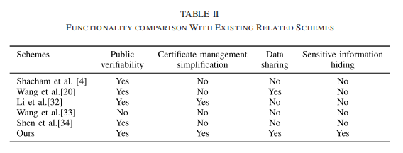
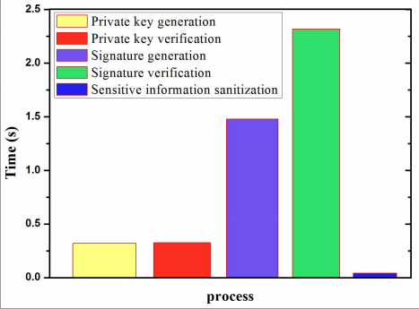
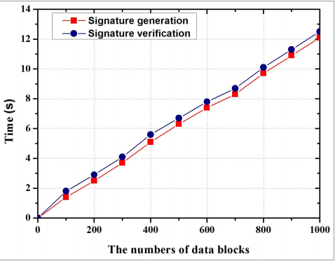

# Enabling Identity-Based Integrity Auditing and Data Sharing With Sensitive Information Hiding for Secure Cloud Storage 论文笔记 

## 基本信息: 

+ 标题: Enabling Identity-Based Integrity Auditing and Data Sharing With Sensitive Information Hiding for Secure Cloud Storage
+ 作者: Wenting Shen, Jing Qin, Jia Yu, Rong Hao, Jiankun Hu
+ 刊物出处: IEEE TRANSACTIONS ON INFORMATION FORENSICS AND SECURITY, VOL. 14, NO. 2, FEBRUARY 2019
+ 链接: [原文链接](http://xueshu.baidu.com/usercenter/paper/show?paperid=087e8c2741005a19c56284afb9763436&site=xueshu_se)

## 主要内容总结:

1. 问题: 现有的安全研究对于远程数据完整性审计中的敏感信息共享技术存在盲区

2. 解决方法: 使用消毒器对文件敏感信息对应的数据块进行消毒，并将这些数据块的签名转换为有效的用于消毒的数据块档案。这些签名用于在完整性审核阶段验证已消毒文件的完整性。
    
3. 具体实现: 
    + System Model
        - 模型中的实体和流程
    + Design Goals
        - 正确性
        - 隐藏敏感信息
        - 审核健全性
    + Definition
        - Algorithm Setup(1k)
        - Algorithm Extract(pp, msk,ID)
        - Algorithm SigGen(F,skID,ssk, name)
        - Algorithm Sanitization(F∗, φ)
        - Algorithm ProofGen(F', φ', chal)
        - Algorithm ProofVerify(chal, pp, P)
    + Security Model
        - 具象化攻防模型

4. 效果:

    + 与同类工作比较
        - 

    + 实验结果
        - 
        - 
## 创新点:

1. 通过该方案可保证数据完整性并隐藏敏感数据
2. 简化证书管理

## 缺点分析:

1. 标题没有讲明技术点，不够明确
2. intro部分内容重复
3. 层次划分太多，使得行文散碎
   

