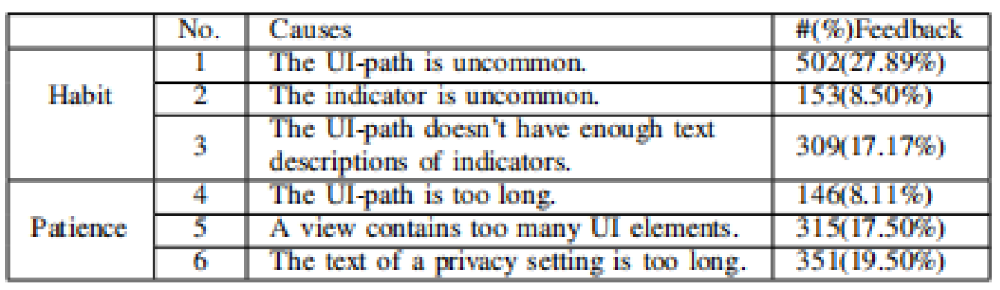
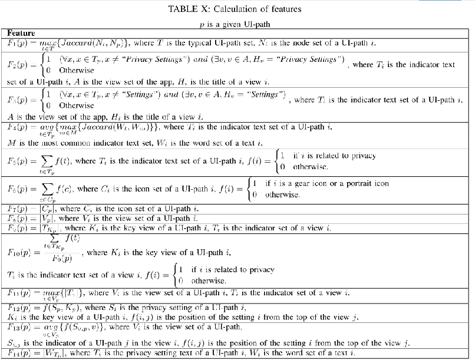
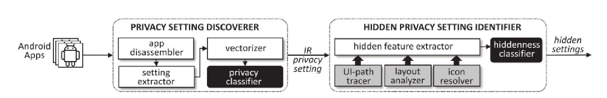
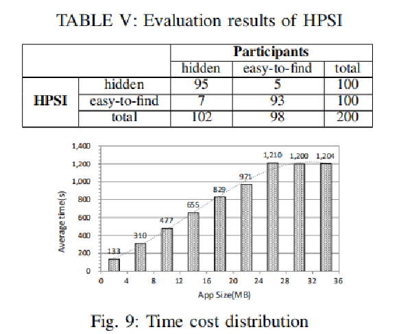
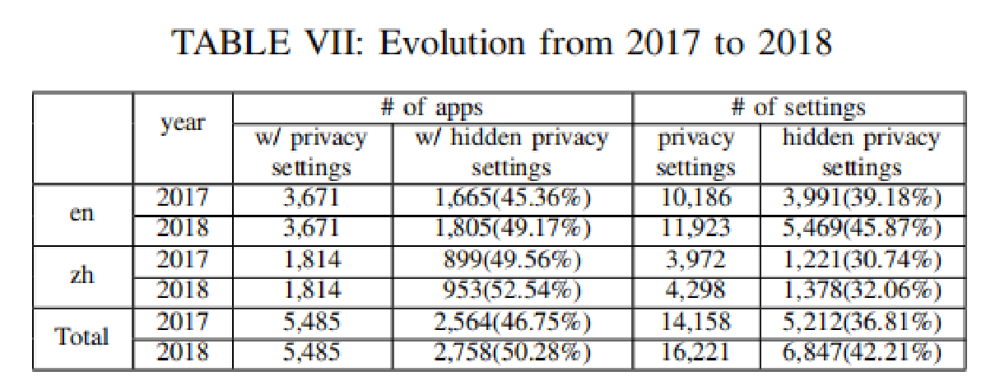

# 《深入浅出移动应用中隐藏的用户隐私设置》论文笔记

## 论文基本信息

- 标题：深入浅出移动应用中隐藏的用户隐私设置  
- 作者：Yi Chen (Indiana University Bloomington, University of Chinese Academy of Sciences), Mingming Zha (Institute of Information Engineering, Chinese Academy of Sciences), Nan Zhang (Indiana University Bloomington), Dandan Xu (Institute of Information Engineering, Chinese Academy of Sciences), Qianqian Zhao (Institute of Information Engineering, Chinese Academy of Sciences), Xuan Feng (Institute of Information Engineering, Chinese Academy of Sciences), Kan Yuan (Indiana University Bloomington), Fnu Suya (The University of Virginia), Yuan Tian (The University of Virginia), Kai Chen (Institute of Information Engineering, Chinese Academy of Sciences), XiaoFeng Wang (Indiana University Bloomington), Wei Zou (Institute of Information Engineering, Chinese Academy of Sciences)
- 出处：40th IEEE Symposium on Security and Privacy。Symposium on Security and Privacy
- 链接：https://www.computer.org/csdl/proceedings-article/sp/2019/666000a850/19skg3Y4ne0
- 笔记作者：王沛然
- Email：1183097399@qq.com

## 论文简要

本文的标题是“Demystifying Hidden Privacy Settings in Mobile Apps”，中文意思是“深入浅出移动应用中隐藏的用户隐私设置”。本文是一篇会议论文，在2019年5月21日发布于40th IEEE Symposium on Security and Privacy。Symposium on Security and Privacy，简称S&P，是信息安全领域四大顶级会议之一。论文主要记录了一次发现用户隐私设置泄露用户信息的社会现象并对这个现象进行分析和研究的研究过程。在这个研究过程中提出了和解决了三个问题：

1）什么是隐藏的用户隐私设置？

2）如何检测隐私设置？

3）如何判定隐私设置是否过于隐秘？

研究团队主要由中国科学院大学，中国科学院情报研究所，印第安纳大学布卢明顿分销，中国科学院大学情报工程研究所，中国科学院信息工程研究院，弗吉尼亚大学多个研究生和导师构成。

## 主要内容

作者主要研究了如何检测用户隐私设置和如何分类出过于隐秘的用户隐私设置的方法。

作者首先发现了在各大手机应用商城中的应用都存在的问题：一些移动应用中的的设置（如对好友展示当前位置等）很可能泄露用户隐私信息，并且在默认情况下是默认打开的，而不少这样的隐私设置由于一些原因难以被一般用户找到，因而导致用户隐私被手机应用泄露的几率增大

作者首先根据上述结论，在他所在的学校中开展问卷调查，根据调查结果总结在经受调查的移动应用中存在多少隐私设置、多少隐私设置难以被用户找到以及这些隐私设置为什么难以被用户找到的原因。

作者进而根据调查的数据总结出了导致隐私设置过于隐秘难以被用户找到的六种原因：

接着，作者根据收集到的数据和总结出来的六种原因构造隐藏的隐私设置的特征：

基于构造的特征，作者团队开始开发HOUND这一工具：

HOUND，中文意思为“猎狗”，意思就是“猎捕”移动应用中的用户隐私设置。HOUND主要分为两大模块：

- PSD（Privacy Setting Discover）：PSD作用是发现移动应用中的隐私设置。PSD首先将应用程序转换为IR代码，接着提取应用程序中的所有设置及其文本解释信息，最后将文本转换成数值向量并训练分类器。
- HPSI（Hidden Privacy Setting Identifier）：HPSI的作用是识别已经发现的移动应用中的隐私设置中的过于隐秘的那些，主要使用基于语义的方法。基于视图的标题与用户点击的指示器（如图标、文字）具有的语义联系追踪隐私设置的UI路径；从一个应用程序中提取所有的指示器和视图，包括它们的语义，然后连接具有相似语义的指示器和视图，一步一步构建完整的UI路径。

在HOUND这一工具开发完毕后，作者利用HOUND对之前调查的移动应用进行识别，得到的结果：

从上图来看，HOUND的挖掘效果很不错，并且效率也很好，耗时不长。

接着，作者也提出了从2017-2018间隐藏的用户隐私设置的现状：

从上表我们可以发现，无论是包含隐藏的用户隐私设置的APP的比率还是隐藏的用户隐私设置数量都增加了，这说明这种现象对用户隐私的侵害更加严重了。

根据以上的调查情况，作者提出了自己的结论：隐藏的用户隐私设置增多是因为开发者没办法很好地衡量用户隐私的安全性和APP的实用高效性之间的平衡，并且大部分APP开发者没有办法很好的对用户界面和指示器进行布局，进而导致用户隐私设置难以被找到并且逐渐增加。

在文章的最后，作者总结了他们在调查中的不足之处：

- 每个APP只有5个人对它的隐私设置的隐秘程度进行评分，样本太少，存在偶然性和主观臆断的错误；
- 大部分问卷调查参与者都是在作者团队校内的计算机及计算机相关专业的学生，样本选择不够全面；
- HOUND工具没办法很好地对从网上实时加载设置的APP中的用户隐私设置进行挖掘；

## 文章优缺点

### 优点：

- 思路清晰明了，图表很多，使文章内容更加明了
- 数据丰富详实，客观地反映了HOUND工具的各项工作指标
- 第三方市场在表格中单独列出，不做赘述
- 将自己调查的不足之处列举了出来，方便后续研究者的研究

### 缺点：

- 个别数据缺少描述
- 用词不够准确
- 对HOUND所使用的基于语义的方法缺少具体的阐述和分析
- Abstract中的数据过于繁杂，导致冗余

### 创新点：

- 使用了基于语义的方法追溯并构造UI路径
- 之前的移动应用的隐私保护研究者主要着眼于如何通过对系统权限进行设置来保护用户隐私，而作者则开创性地着眼于用户隐私设置，提供了更加广泛的隐私保护
