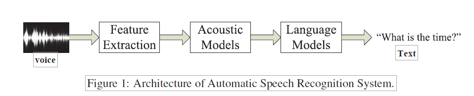
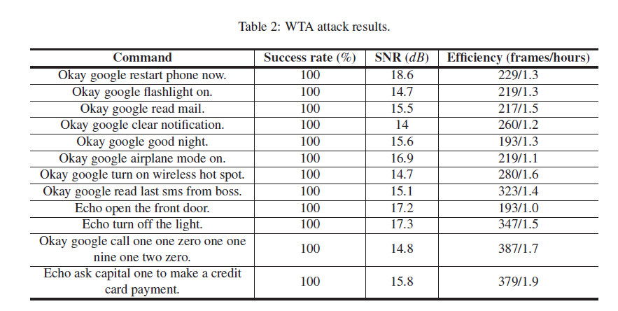
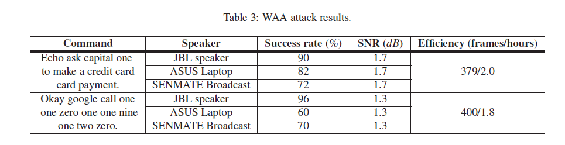
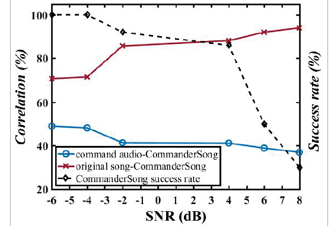

# 论文阅读笔记

- 笔记作者：方钰舟
- 原文作者：Xuejing Yuan1,2, Yuxuan Chen3, Yue Zhao1,2, Yunhui Long4, Xiaokang Liu1,2, Kai Chen∗1,2, Shengzhi Zhang3,5, Heqing Huang , XiaoFeng Wang6, and Carl A. Gunter4
- 原文题目：Commander Song: A Systematic Approach for Practical Adversarial Voice Recognition
- 原文期刊: The 27th USENIX Security Symposium

### 摘要

​	ASR自动语音识别系统的不断发展与广泛应用的同时带来了一系列的安全隐患。针对ASR的一般的攻击需要通过使用physical presence等设备，使得攻击的隐蔽性较差。这篇文章通过将攻击指令隐藏在歌曲（音频）中的方法，实现了针对ASR的隐蔽性攻击，同时并这对以上的攻击漏洞，提出了较为有效的防范方法。

## 1.研究内容

​	当前的ASR系统包括主流的微软开发的Cortana，苹果公司开发的Apple Siri等都使用了深度学习的方法对于人声进行自然语言处理。然而如果针对输入的自然语言音频进行有目的的扰动，将会使得这些ASR系统内核中核心的使用深度学习方法训练得到的模型输出的结果有着极大的不同，由此造成了严重的安全危害。

​	

​	该篇文章随后总结了当前已有的针对图像识别和语音识别系统的攻击方式，并在此之上提出了进一步提出了自己的工作。根据他人的研究表明，针对DNN的图像识别的攻击是可行的，由此启发了该文章能否针对ASR中可能集成有DNN的模块进行攻击。

#### 攻击方法：

1. 首先基于开源语音识别工具包Kaldi 进行实验。
2. 深入研究Kaldi之后，使用Kaldi进行语音识别的解析，在这个过程中使用了DNN。
3. 完成对Kaldi的理解后，该文章使用Kaldi对攻击音频和原始歌曲分别进行解码。
4. 如图所示，该文章将原始音频与命令音频在解码过程中DNN矩阵的输出矩阵（代表每一帧的pdf-id）通过梯度下降法寻求局部最优解，使得这样制作出的音频可以被解析为命令音频代表的命令。
5. 为了更好地对原始音频进行保真，该文章减少了每个音素中的帧的个数。
6. 为了进一步能够在现实环境中实现攻击（在包含有较多噪声的情况下），该文章捕获了正常歌曲的噪声，并重新修改目标函数进行训练。

#### 实验结果：

1. WTA(Wave to API)攻击实验结果。

   

   - Success Rate表示语音可以被正确解码的概率。
   - SNR（dB）是用于衡量对原始音频干扰程度的数学量，SNR越大，表示干扰越小。 

2. 同理，WAA attack(WAV-Air-API)实验结果如下图。

   

   原始音频和合成攻击命令之后音频的SNR曲线如下图

   

   #### 检测

   ​	该文章提出了两个方面的检测方案，一个为**Audio turbulence**，另一个为**Audio squeezing**

   1. **Audio turbulence**：主要思想是在将目标语音输入到ASR中进行解析时，加入一定的噪声流，并同时检查该目标语音是否还能解析为其他命令。
   2. **Audio squeezing**：降低输入音频AI的采样率。

   ## 2.创新点

   ​	该文章的idea新意十足，不被传统的思想观念所限制，通过借鉴针对深度学习识别图片的进行攻击的思想，创新性的在针对ASR语音识别系统进行攻击与测试。通过对输入ASR的原始音频与攻击命令音频进行融合，在最大程度不改变原始音频的条件下是的ASR将原始音频解析为了攻击音频中所包含的指令，是非常大胆与创新的想法。

   ## 3.论文评论

   ​	这篇为发表在安全四大顶会之一的USENIX  Security上的一篇文章，具有非常强的创新性。很好地将深度学习和安全相结合，利用深度学习的方法制造攻击的音频，令人感到惊奇。不过这篇文章还是有着一些局限性，在现实环境中的实验设备仅仅只使用了IPhone 6s，然而随着时间的不断推移，语音识别技术不断更新迭代，他们提出的技术能否真正的在最新一代的大众手中的电子设备起到攻击效果仍然是一个疑问。

   

​	

