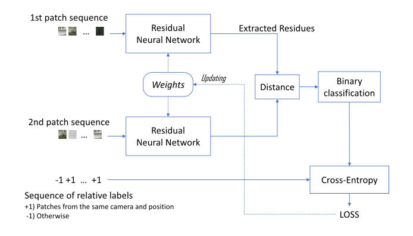
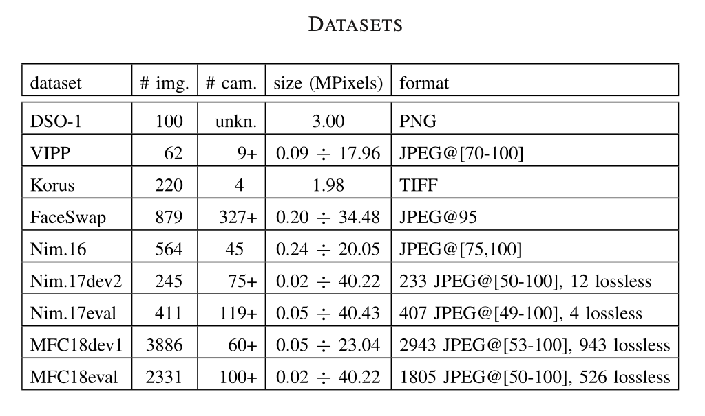
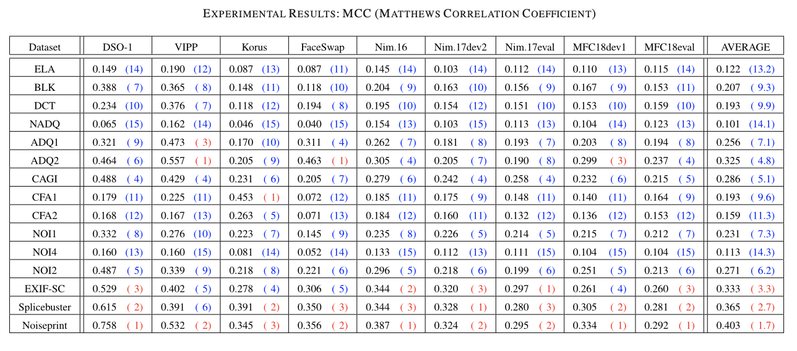
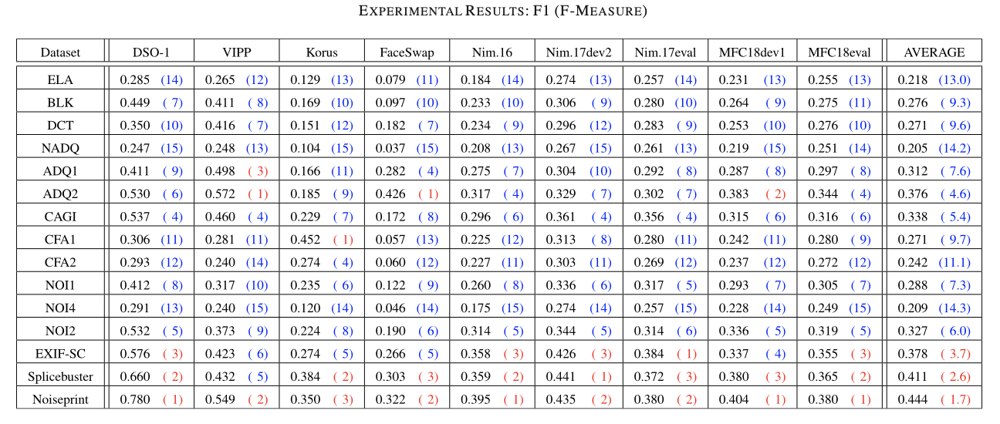
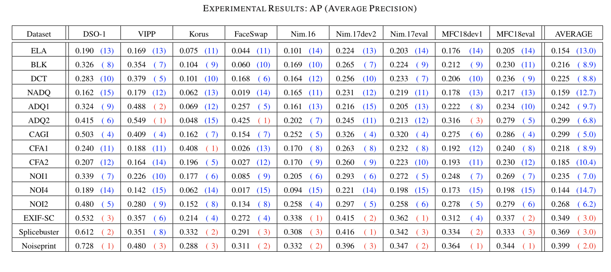

- 笔记作者：石子齐
- 原文作者： Davide Cozzolino and Luisa Verdoliva 
- 原文题目：Noiseprint: A CNN-Based Camera Model Fingerprint 
- 原文来源：IEEE TRANSACTIONS ON INFORMATION FORENSICS AND SECURITY, VOL. 15, 2020 

当下对数字图像的取证分析在很大程度上依赖于所获取图像上的相机内外处理的痕迹。这样的痕迹可以被看作是一种相机指纹。如果能够恢复它们，则可以通过抑制高级内容及其他干扰来轻松完成许多取证任务。本文基于卷积神经网络，通过提取一种称为噪声指纹的相机模型指纹的方法，来增强模型相关的伪像。

### 1. 研究内容

架构：

数据集：使用了9个各具特点的数据集，其中的格式，大小，相机种类都有所不同，呈现出了多种特性。

模型：使用孪生CNN网络对噪声残留进行提取，进行距离计算和分类，然后使用交叉熵计算出LOSS对神经网络的权重进行更新。

评估结果：使用了比较概要化的表现方式来呈现在所有referenced method和datasets情况下的结果。

)

结果后面括号里的值表示排名，其中前三使用红色。最后一栏为三种指标下的平均performace和评价rank。可以看出文章中主要使用的Noiseprint总是位列前三，说明其在各种数据集多种特性的情况下仍有不凡的表现。

### 2.创新点

本文的主要创新点如下：

- 参考了许多同领域方向先前的方法，并给出了较为充分的理由证明Noiseprint方法的优秀
- 提供了多样的更深入探讨，比如给出了所有数据集下的ROC曲线来探讨相机模型识别，以及去马赛克算法识别还有非传统篡改技术检测等。

### 3.整体评价

本文整体来说并没有什么缺点，在方法的阐述上清晰明了，在结果的表达上十分全面，其中都有许多值得初学者借鉴学习的地方。个人认为是一篇很不错的论文。