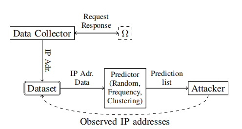
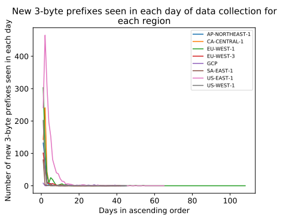
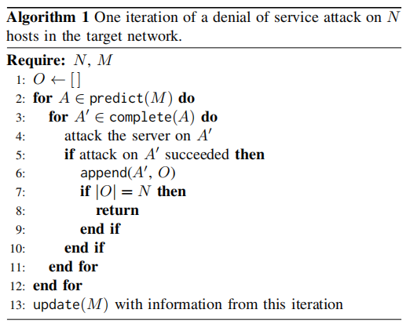

- 原文标题：Predictability of IP Address Allocations for Cloud Computing Platforms

- 原文作者：Hussain M.J. Almohri, Layne T. Watson, David Evans

- 原文出处：DOI 10.1109/TIFS.2019.2924555, IEEE. Transactions on Information Forensics and Security

- 笔记作者：张颢

使用不可预测的网络地址是对抗基于云的虚拟网络拒绝服务攻击的一种方法，但是这种方法有效的前提是攻击者很难预测新分配的IP地址。本文主要分析云提供商使用的IP地址在实践中是否足够不可预测。本文通过分析了两家主要的云计算提供商的IP地址分配行为，发现分配的IP地址所提供的实际熵是有限的。本文评估了基于频率的模型和一个马尔科夫过程模型，从收集的IP地址的时间序列数据生成一个地址预测集。

#### 1. 研究内容

收集数据：攻击者记录观察到的ip地址。

        图一  攻击者收集和预测目标网络ip地址的过程

数据分析：对ip地址的前缀和数量，数据的完整性，数据的频率做出分析。计算出数据熵和重复率。在分析方面，通过测量在数据收集过程中几天后观察到多少新数据来估计完整性，对数据按时间的升序排序。

    图二 从分配IP地址的最早日期开始，新的三字节前缀数量

攻击模拟：攻击者使用用随机、频率或集群算法来预测ip。攻击者在目标网络分配新ip后立刻开始攻击，根据攻击中的成功或失败的次数计数。

   图三 攻击算法

攻击结果发现三种攻击策略在所有的迭代中命中率至少为90%，大部分都在95%以上，除了随机攻击在GCP中表现不佳，在整个攻击模拟中命中率为33%。

#### 2. 创新点

本文采用了随机、频率、聚类以及并行的攻击策略对目标网络生成的ip进行了预测，并分析了每种方法的可预测性等优缺点。得出了攻击者可以可靠的预测云IP地址分配的结果。

#### 3. 论文评论

这篇论文对我来说读起来比较困难，从语言和技术上来讲都是。不过为我开拓了一个新的思路，发现原来云服务商提供的ip地址原来是可预测的。云计算平台使用的地址空间有限。虽然实际的IP地址分配可以是随机的，但IP地址的可用性会影响移动目标防御系统的可预测性。

论文的缺点是在学习阶段只使用了一种数据收集方法，可以尝试使用不同的数据收集方法来收集数据。