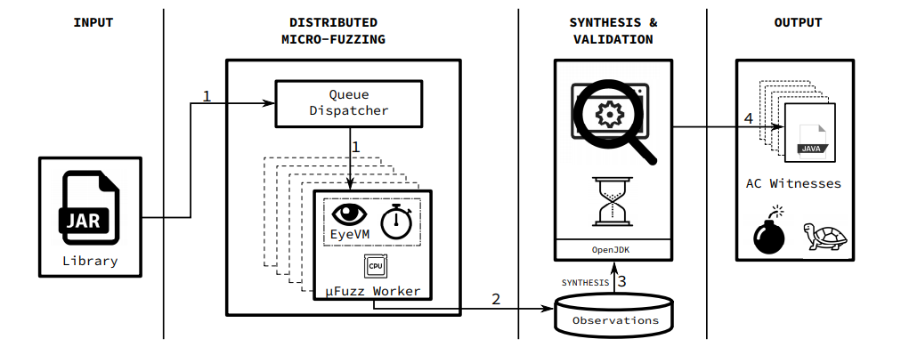

# 论文笔记
* 论文标题：HotFuzz Discovering Algorithmic Denial-of-Service Vulnerabilities Through Guided Micro-Fuzzing
* 论文作者：_William Blair (Boston University), Andrea Mambretti (Northeastern University), Sajjad Arshad (Northeastern University), Michael Weissbacher (Northeastern University), William Robertson (Northeastern University), Engin Kirda (Northeastern University), Manuel Egele (Boston University)_
* 论文出处：Network and Distributed Systems Security (NDSS) Symposium 202023-26 February 2020, San Diego, CA, USA
* 笔记作者：nanaY
* 论文链接：[文章链接](https://www.ndss-symposium.org/wp-content/uploads/2020/02/24415-paper.pdf)
## 论文笔记信息
**1. 研究背景**  
在目前超过百亿运行JAVA的设备上，发现其面临的任何未知的安全威胁仍然是一项重要任务。对这些设备采取模糊测试以触发以外的程序行为，已经发现了很多严重的安全漏洞，当代的模糊测试技术专注于识别内存损坏漏洞，但作为拒绝服务攻击的常见攻击向量的算法复杂性（AC）漏洞仍然是被忽视的威胁。所以对与JAVA库中的AC漏洞发现以目前技术还存在不少缺陷。  
**2. 论文主要工作**  
本文主要目的是构建一个模糊测试框架——HotFuzz，用于自动发现Java库中AC漏洞。HotFuzz使用微模糊测试，这是一种遗传算法，可以逐步演化任意Java对象，以触发被测方法的最坏情况性能。作者先通过对AC漏洞使用现有的模糊测试方法SlowFuzz和PerfFuzz进行漏洞发现，但实际效果不如人意。而与这些工具相比，HotFuzz不需要分析人员手动定义测试工具来模糊库中包含的各个方法。
作者声称的HotFuzz采用动态测试方法来检测AC漏洞，该测试过程包括两个阶段：①微模糊测试；②见证人合成和验证。这之中，微模糊测是HotFuzz中的关键，代表了一种全新的漏洞检测方法。  
下图为HotFuzz测试过程的体系结构总览图  
  
最后作者给出了HotFuzz使用通过特定于Java的身份值和小型递归实例化技术的测试工件证明被测方法中存在AC漏洞的输入。同时他们的团队使用HotFuzz做了大量JAVA环境下的AC漏洞分析，并取得了很显著的成果——大量漏洞被检测到！  
**3. 创新点**  
本文创新点在于
①创新使用了micro fuzzing技术结合到模糊测试框架中
②HotFuzz使用通过特定于Java的身份值和小型递归实例化（IVI和SRI）技术  
**4. 存在问题**  
目前作者介绍的HotFuzz框架检测水平还不够高，会很容易出现误报，导致处理上的技术问题