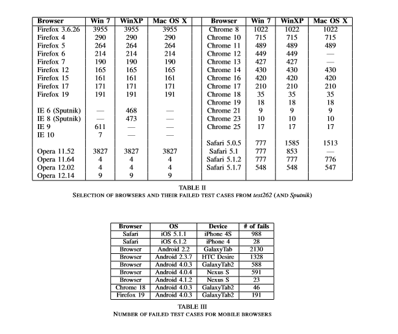

-   原文作者： Martin Mulazzani, Philipp Reschl, Markus Huber, Manuel Leithner, Sebastian Schrittwieser and Edgar Weippl
-   原文题目：Fast and Reliable Browser Identification with JavaScript Engine Fingerprinting
-   原文来源：WEB 2.0 SECURITY & PRIVACY 2013
-   原文链接：https://publications.sba-research.org/publications/jsfingerprinting.pdf

在当今互联网使用中，浏览器是关键的软件组件。本文提出了一种基于JavaScript引擎识别浏览器的的新方法。

### 1、研究内容

#### 方法实现

- 高效的Javascript指纹识别

使用数千个Javascript独立的测试用例，同时浏览器的测试集是给定实体的一组浏览器和浏览器版本。

- 最小指纹

使用贪婪算法来查找（可能是最小的）给定测试集的指纹。

- 建立决策树

无需先验即可识别用户的浏览器UserAgent，为给定的对象构建一个二进制决策树，并通过运行测试集来评估浏览器是否包含在其中。进行多轮测试，对于每项测试，都会降低一个级别直到最终到达叶节点为止。

#### 评估结果

 

### 2、创新点

本文的主要创新点如下：

-   提出了一种基于JavaScript引擎识别浏览器的的新方法。
-   证明了该方法的可行性和可靠性。
-   展示了如何将其用于检测修改UserA-gent字符串的浏览器。
-   提高对此类高级指纹识别方法的认识。

### 3、目前缺点

- JavaScript标准变化较快，并且浏览器的JavaScript快速迭代，有可能导致此种方法识别出现偏差。
- 可结合HTML或CSS对浏览器进行识别。