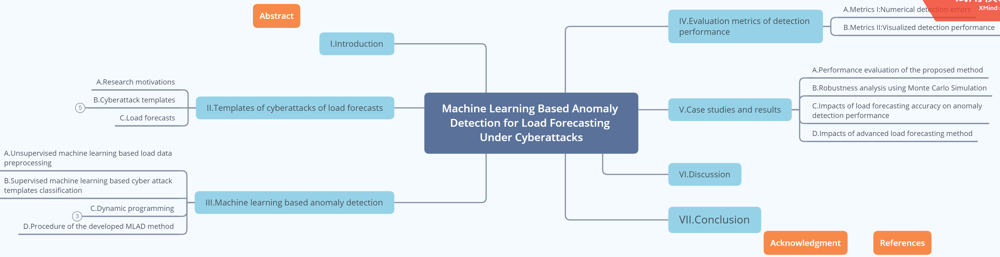

### 一、论文基本信息

论文标题： ***Machine Learning Based Anomaly Detection for Load Forecasting Under Cyberattacks*** 

论文作者： Mingjian Cui,  Jianhui Wang,  Meng Yue 

刊物出处和链接：IEEE TRANSACTIONS ON SMART GRID *https://ieeexplore.ieee.org/document/8600351*

笔记作者：531051  Harry Potter

### 二、论文主要内容总结

**主要内容**介绍：电力系统的运行决策和计划高度依赖于工作人员针对电网负荷预测数据的判断。本论文提出一种**基于机器学习的异常负荷检测方法**（a machine learning based anomaly detection methodology, **MLAD**），来检测出**针对电力系统负荷预测的网络攻击**。

具体方法是：用K-means聚类算法重构基准/缩放数据范围；根据朴素贝叶斯算法总结出几个网络攻击框架模板；利用动态规划预测数据方面的智能电网攻击的发生率和参数。

通过数据仿真和攻击场景验证，发现MLAD方法有较高准确度和鲁棒性。

**行文框图**如下：

### 三、主要创新点

- 目前的负荷预测方法主要是对预测数据进行异常识别。在本论文中作者创新性地提出了用机器学习技术检测电网负载预测方法的应用，角度比较新颖。MLAD方法流程图：

- 通过该方法，能够利用基于缩放数据重构的监督式学习方法，来总结出针对预测数据的攻击模板；还能估计出一次网络攻击的具体发生率和参数信息。这就直接解答了检测负荷预测网络攻击的关键问题——确定攻击的具体时间范围、预估攻击参数，直戳要点。

- 作者特别指出，任何检测手段都可能被破解篡改，所以针对异常检测模型自身的防御也很重要，并提出了解决方案——分层的防御模型。

### 四、不足和可能的改进方法：

- MLAD无法找出攻击分析的中间过程量的错误，比如预测模型的断裂拓扑、预测方法的伪造参数、预处理受攻击情况。**改进**：分析不同的负荷预测方法对被网络攻击篡改的负荷数据的敏感性，评估不同方法中中间量错误产生的影响，再开发相应解决办法。

- 在处理实际负荷数据材料时，涉及到了非监督式学习算法的选择问题。备选的有K-means、混合模型和层次聚类。在我看来，作者选择K-means的理由（更容易实现、计算更快、产生更紧密集群）并不太完备。**改进**：通过实验数据的对比，说明K-means在性能上的优越性，比如能更准确地针对负载数据进行聚类并重建基准数据，这样可以让非监督式学习算法的选择更具有说服力。

- 为了说明MLAD方法的有效性，作者只以个案研究为基础，展现了方法的流程和结果分析、性能评价（数据来源：ISO New England），我觉得说明起来不够淋漓尽致（我猜测有实验上的困难性的影响）。**改进**：案例可以多一些，性能评价才更全面客观；可以把数据集横向拉大一些，进行各方法的性能对比，更突出MLAD的优势。
