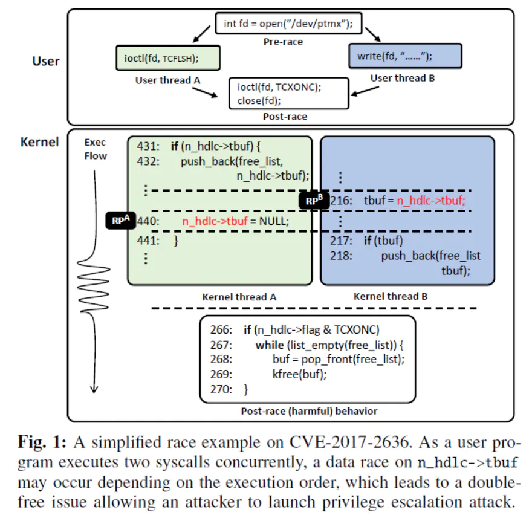
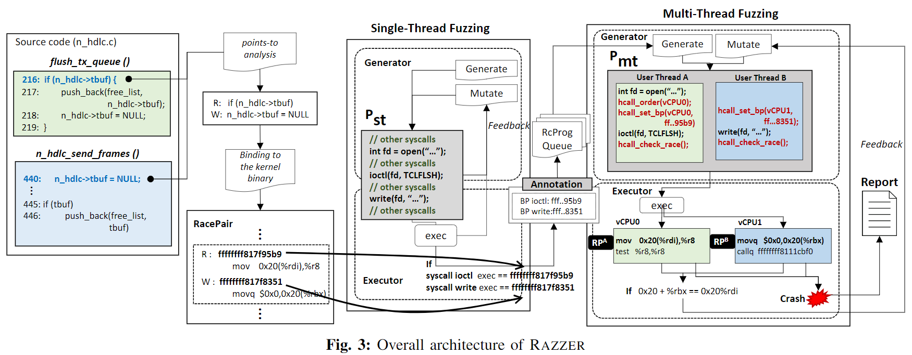

# <论文笔记> RAZZER: Finding Kernel Race Bugs through Fuzzing

## 基本信息

作者：Dae R. Jeong, Kyungtae Kim, Basavesh Shivakumar, Byoungyoung Lee, Insik Shin

出处：IEEE Symposium on Security & Privacy 2019

时间：16 September 2019

链接：https://ieeexplore.ieee.org/document/8835326

## 摘要

目标：挖掘竞争漏洞，如CVE-2016-8655, CVE-2017-2636, CVE-2017-17712。

问题：条件竞争漏洞受到系统不确定行为的影响，如线程调度与同步机制。因此与普通的漏洞相比，要检测这类漏洞除了需要控制流和数据流信息以外，还需要精准的并行执行信息。

技术：静态分析定位可能引发竞争的代码；确定性的线程交错技术，控制线程调度，提供准确的并行执行信息，降低不确定性。	

结果：发现30个竞争漏洞，16个已确认。

## 问题与设计需求

1. **数据竞争定义**

    若两条指令满足以下条件则为数据竞争：

   1. 访问的内存地址相同
   2. 至少其中一条指令是对内存的写
   3. 两条指令可以并发执行

2. **标记**

   - RacePaircand——可能满足以上条件的指令对
   - RacePairtrue——已确定满足以上条件的指令对
   - RacePairbenign——良性竞争
   - RacePairharm——有害竞争

3. **竞争案例**

   两个线程分别调用`ioctl(fd, TCFLSH)`和`write(fd, …)`，对变量`n_hdlc->tbuf`的并发读写导致竞争（`n_hdlc->tbuf = NULL;`与`tbuf = n_hdlc->tbuf;`)，该内存地址在free_list中保存了两次，最后`ioctl(fd,TCXONC)`将导致double free

   

   4. **设计要求**
      - R1——找到执行RacePair_cand的输入程序。即找到一个多线程的用户态程序，每个线程能够在内核态分别执行到RacePair_cand的指令。需求1把问题做了简化，并不去考虑并行执行的问题，就不用考虑线程调度对分析的影响。
      - R2——根据R1输入程序，找到并发执行RacePair_cand的线程执行序列。需求2主要是去寻找一个交错执行的线程调度方案，使得RacePair_cand的指令能并行执行。

## 设计

整体流程如图：

1. **识别RacePair_cand**

   方法：指向分析（寻找内核中对同一个结构体的内存访问），但限制是准确率与性能，需要精确的CF/DF信息（运行时更准确）和并发信息（受到调度和同步原语的影响）。

   改进：采用指向分析得到近似的RacePair_cand（上下文敏感、流敏感、区域敏感），后续通过动态分析来确认。去除不会引起竞争的指令，例如访问结构中不同变量；分部分分析，减小分析的代码量。作者按目录结构划分模块，如kernel, mm, fs, drivers，但有些模块如fs和net/core会被每个模块调用。

2. **调度器**

   方法：待Fuzz的内核运行在虚拟化的环境中，为了控制虚拟CPU的调度，作者修改了虚拟环境的Hypervisor，增加了三个功能。

   1. 为每个虚拟CPU设置断点
   2. 控制线程执行顺序
   3. 检测竞争结果

3. **多线程**

   这一步的关键是将单线程Fuzz输出的一个单线程程序Pst，转化为一个多线程版本Pmt。在转换过程中还会进行一些插桩，与Hypervisor协作控制程序的调度

   1. 单线程fuzzing

      目的：生成单线程程序，执行RacePair_cand。

      generator：生成单线程用户程序P_st—随机syscall序列。两种策略：一是generation，使用syzkaller定义的syscall语法（含参数值范围），生成随机调用序列，传递调用参数；二是mutation，对已有的P_st进行drop/insert/change。

      executor：执行P_st。

   2. 多线程fuzzing

      目的：生成多线程程序，触发竞争。

## 评价

**创新点**

1. 作者通过静态分析得到一些RacePair_{cand}，再用动态分析确认，既降低误报又减少了搜索空间。
2. 通过算法与工具的结合，给Fuzz工具提供了比较准确的线程并行执行状态，解决了Fuzz多线程程序的一大难点。

**缺点**

1. 本文假设不同内核模块之间很少有竞争，分部分分析可能错过很多条件竞争状况。
2. 目前只支持linux，可扩展到其他平台。