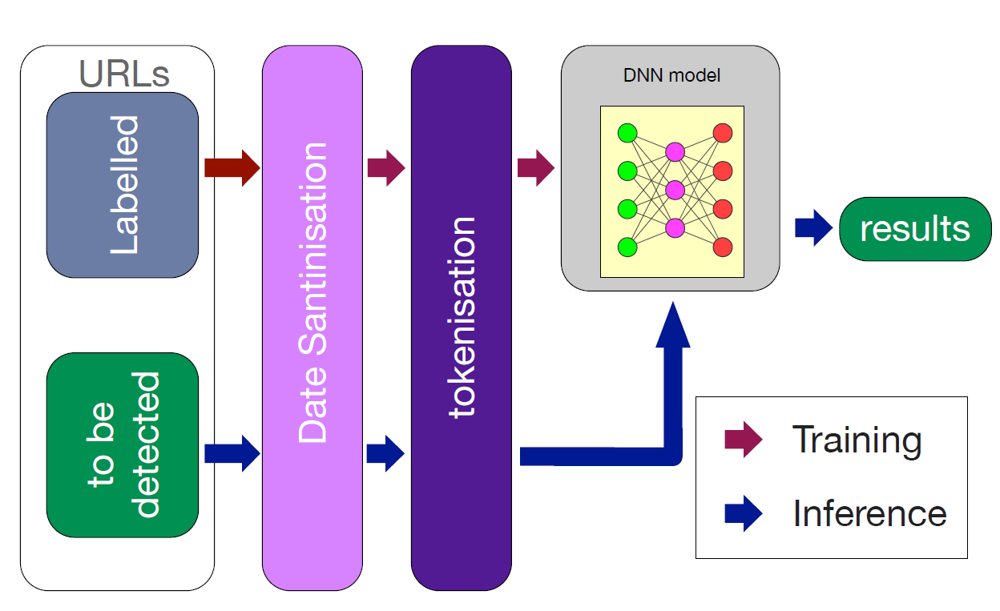
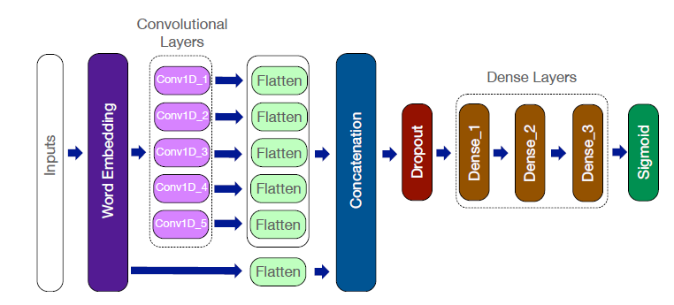
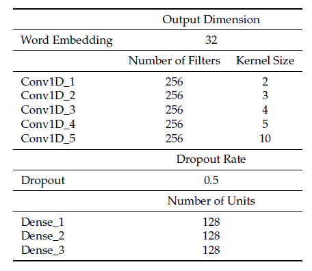

- 笔记作者：@Xiaoyu Xue
- 原文作者：Bo Wei, Rebeen Ali Hamad, Longzhi Yang, Xuan He, Hao Wang, Bin Gao and Wai Lok Woo
- 原文题目：A Deep-Learning-Driven Light-Weight Phishing Detection Sensor
- 原文来源：IEEE SENSORS 2019

网络钓鱼是一种常见的社会工程手段，攻击者可以利用url来欺骗用户。传统钓鱼检测是基于用户的手动报告，随着机器学习的发展，近年来也出现了许多利用深度学习来提高鉴别钓鱼网站的能力。本文提出了一种轻量级的深度学习算法来检测恶意url，实现了一种实时、节能的钓鱼检测传感器。

#### 1、研究内容

系统架构：钓鱼网站识别系统结构如下所示，将标记过后的URL和待检测的URL传入Date Santinisation，处理后转入tokenisation，放入DNN模型得出结论。

传感器处理过程：根据训练出的模型，传感器处理过程结构图如下

数据集：采用基于名单的钓鱼网站监测来提供数据集。一般分为白名单和黑名单。白名单是用户信任的URL地址，否则加入黑名单。数据集来自Alexa前100万网站, hphosts,、Joewein、malwaredomains和phishtank。数据集统一去除“https://”、“https://”、"www"等前缀，采用独热编码。

模型：本文采用深度神经网络模型，具体如下图所示。第一层为嵌入层，输出规格为32、第二层为卷积层，卷积尺寸分别为2，3，4，5，10、第三层为连接层、第四层为降层，丢弃率为0.5、第五层为全连接层，连接单元个数均为128、最后一层为激活层，采用sigmoid激活函数。

评估结果：测试准确率达到了86.630%。本文发现随着全连接层数的增加，模型的准确率也会随之增加。一个全连接层的准确率为86.537%、两个为86.538%、三个为85.542%。

#### 2、创新点

本文的主要创新如下：

- 提出了一种新的字符级多空间深度学习模型
- 将提出的模型集成到了单板计算机上
- 讨论使用资源受限的计算设备来启用钓鱼网站检测传感器的可行性

#### 3、论文评论

就利用卷积神经网络检测钓鱼网站而言，本文的创新力度是不够的，测试准确率也并不高。但是本文将模型集成到单板计算机上，并考虑了在这种计算资源受限的设备上进行运算还是可圈可点的。本文花了大量篇幅描述卷积神经网络在检测钓鱼网站上的使用，就后面集成单板机的描述稍有点薄弱，后续还可提出其他的改进方案。