###### 
论文赏析

##### 论文题目：Hybrid neural network framework for detection of cyber attacks at smart infrastructure

用于检测智能基础设施中网络攻击的混合神经网络框架
==========================================================
###### 作者：Vasiliy Krundyshev,Maxim Kalinin
###### 出处:SIN '19: Proceedings of the 12th International Conference on Security of Information and NetworksSeptember 2019 Article No.:9 Pages 1–7
###### 链接：https://doi.org/10.1145/3357613.3357623
### 简介：
#### 这篇论文写于2019年9月，十分具有时效性。作者提到：当今世界，通信网络的规模和效率的提升十分迅速。我们将在不久的将来将5G技术广泛引入社会, 当无线通信变得越来越可靠和迅速，万物互联、人工智能、自动工厂等一些产物将会迎来发展的黄金时期。人民生活更加方便迅捷的同时，大规模DDOS、网络黑洞、灰洞等层出不穷的入侵也会对网络造成严重的影响。
#### 因此，作者希望利用近些年十分火热的神经网络（ANN）完成一个框架，用于检测识别这种大规模且具有较强自动和智能化网络中的网络入侵威胁。  作者分析了多种神经网络模式的优劣，从而选择最适合做攻击检测框架的一种。对检测和优化的方法进行了改进，提高了入侵检测的正确性。此框架在多种类型的路由攻击中显示出了约96%的正确性，可以有效预防智能网络崩溃现象的发生。

###### <ul>要点：  <li><h>入侵检测系统</h></li><li>神经网络</li>
##### </ul>

###### 关键字：人工智能，网络安全，混合框架，机器对机器，神经网络，智能基础设施

### 背景：
#### 机器与机器之间组成的动态的具有一定自动性的网络是当今用于数据通信方面的先进技术之一。再加上现在正在推进的5G建设，使得这种网络变化更快、结构更多。多用于物联网、无人驾驶汽车、人工智能、无人机和传感器等通信和交互领域。迅猛的发展带来的不只有进步，还有无处不在的安全威胁。人们的生活更加虚拟、数字化，虚拟资产的价值也成几何倍数增长。
####   神经网络的主要优势在于它可以识别通信数据中更深层次的一些特征，能够对收到的响应做出响应。 <ul>作者分析了多种神经网络模式：
###### <li>递归神经网络RNN：使用”内存机制“能够解决很多复杂的问题，并且结果十分准确。缺点是学习的周期较长、需要的数据量较大。总体比较适合做入侵检测框架。</li>
###### <li>尖峰神经网络SNN：更紧密地模拟自然的神经网络，可以处理非实时数据，需要特殊的硬件。不适合开发入侵检测框架。</li>
###### <li>人工神经网络ANN：具有传统的神经网络体系结构，学习曲线短，工作时间短。根据任务的复杂性不同，该体系的精准度会有偏差。总体适合开发入侵检测框架。</li>
###### <li>模糊神经网络FNN：Fuzz技术和神经网络的产物。不适合开发入侵检测框架。</li>
###### <li>小波人工神经网络wavelet ANN：总体上相似于ANN，具有特殊的激活功能，能够执行分类任务。适合开发入侵检测框架。</li>
###### <li>LSTM：总体上相似于RNN，具有长短期记忆，改进了内存机制。适合开发入侵检测框架。</li>
###### <li>生成对抗神经网络GAN：适用于复杂性质的数据类型，也适于解决此类安全问题，例如身份验证等。缺点是体系结构比较复杂，学习曲线很长。不适合开发入侵检测框架。</li>
###### <li>深度神经网络DNN：即大家耳熟能详的深度学习，是ANN的发展延续。对数据进行表征学习，准确性总体较好，主要由问题的复杂性决定。适合开发入侵检测框架。</li></ul>

### 作者考虑提高神经网络准确性的方法：

##### <ol><li>增加神经网络训练的数据集</li><li>充分利用神经网络中的“激活”功能</li> 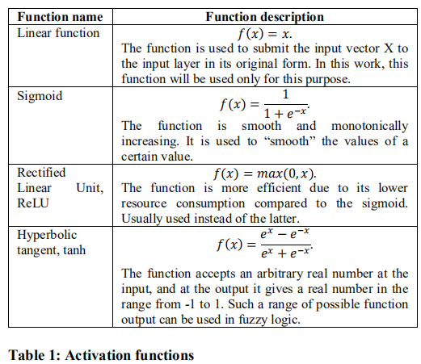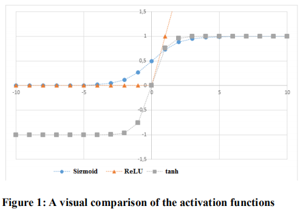<li>优化具体实现过程中的算法 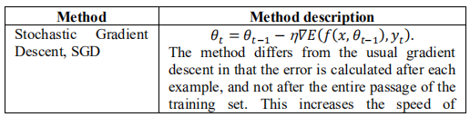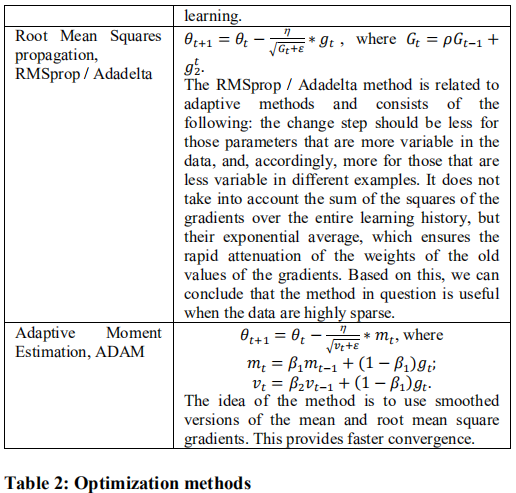</li></ol>

##### 作者也提到，各种可用来优化人工神经网络工作的方法都有自己的机制，不可能全部使用，需要通过实验来评估哪些方法在检测攻击方面更加准确。为了计算ANN输出的准确性，作者选择使用均方误差MSE。

### 设计过程：（建议快速浏览）
##### 由于动态的路由网络特性和攻击者的隐蔽性，再加上层出不穷的攻击手段，检测攻击的复杂性必须要着重考虑。作者选取了网络黑洞、灰洞、蠕虫和DoS作为具体的网络攻击。在模拟过程中，数据集一部分用于训练，一部分用于验证。

#### 黑洞：
##### 攻击检测模型描述如下。设路由T为从某些数据的传输节点 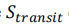到传输目标节点的传输路径为：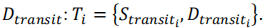
##### 考虑集合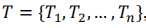，观察到以下特征：
##### 1.在路由T1中，源的传输节点是节点S，它要传输到网络中的某个远程（未直接连接）节点；
##### 2.在路由Tn中，目的传输节点是节点D，它等待网络中远程源节点的数据。
##### 5个节点的拓扑的T的集合为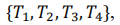，其中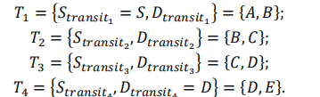
##### 检查数据是否已经到达目的远程节点D，如果正常到达，说明没有遭受到Black Hole攻击。反之，若没有正常到达，则在完成了传输的步骤中出现了攻击。
##### 本次实验选择了LSTM神经网络，作者给出了几种比较好的优化配置方案。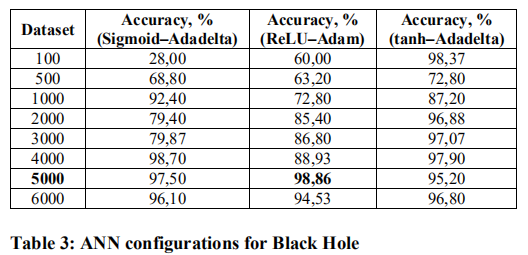
##### 结果显示：使用ReLU-Adam且训练数据集大小等于5000，可以在测试数据集上达到98.86％的最大准确性。

#### 灰洞：
##### 从源节点A将6个部分的数据传输到目的节点E。总共将有6个通道：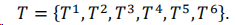
##### 在数据的第i部分从源节点A合法传输到目标节点E的情况下，路径集合如下所示：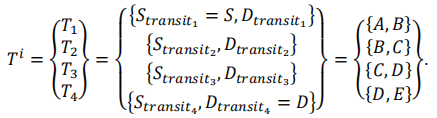
##### 在网络上出现攻击的情况下，将数据的第j部分从源节点A传输到接收者节点E时，路径集合将如下所示：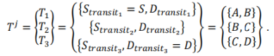
##### 考虑到在合法传输（Ti）和非法传输（Tj）情况下路径集之间的差异，可以引入以下标准来检测攻击：
##### 如果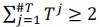，由于不是所有数据都能到达接收节点，因此可以判断网络上遭受了攻击。判断此时攻击者是Tj路径集的最后一个节点：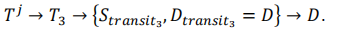
##### 如果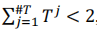，则当前网络中没有出现攻击。
##### 此次实验作者也是使用的LSTM体系结构，一些较好的优化配置如下表所示。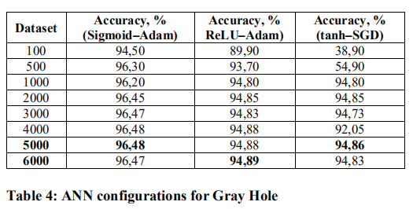
##### 给出的这三种配置在大型的训练数据集上都有很高的准确率。

#### 蠕虫:
##### 设集合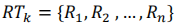为位于网络中的第k个节点的路由表。该集合表示为由Ri表示的一组记录。令第k个节点长时间存在于网络中，并且其路由表具有等于n的一定数量的条目。然后，设置的RT将具有以下形式：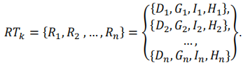
##### 通信的特点：
##### 1.对于任何i,j都有Ii = Ij。这是因为每个节点都使用相同的网络接口。
##### 2.对于Ri，都可以从已知的Di，Gi，Ii获得网络地址N。通常，此类地址表示为带有掩码的标准IPv4地址。
##### 考虑RTl，这是入侵发生时的路由表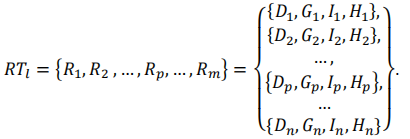
##### 在其路由表中应有一个条目，它表示用于与攻击者进行通信的第三方接口。在此过程中，接口还必须指定目标节点的地址，默认网关的地址和跳数。
##### 假设在RTl中Rp条目出现入侵者：
##### 1）在记录中，Dp和Gp的值相同，因为它们指定了隧道的另一端-目标节点的地址和与之相等的默认网关地址；
##### 2）接口地址Ip与表中其他条目中存在的所有其他接口条目不同；
##### 3）Hp记录的跳数为1，因为隧道路径中的下一个节点是目标节点。
##### 通过现有值获得的现有Rp条目使您可以恢复攻击者使用的网络地址N'。令让Rr为表中另一个入侵者节点的记录：
##### 作者为这种攻击选择了小波的ANN模式，给出了最佳配置表。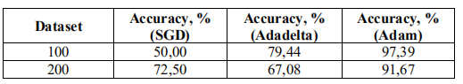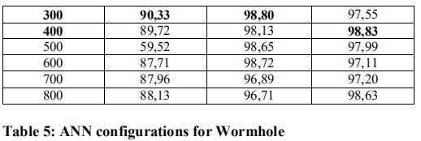

#### 拒绝服务攻击：
##### 在网络数据包流量遭到拒绝服务攻击的情况下，可以观察到许多路由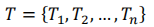,从而有：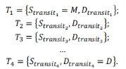
##### 由于攻击涉及大量发送不同数据，因此假定存在迹线T <--T^m，其数量超过了1：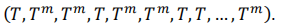
##### 因此：
##### 1）如果在网络流量中检测到T^m路径的数量不超过2，则没有发生网络攻击，因为存在一次和二次合法数据传输；
##### 2）如果在网络流量中检测到一组路径T^m大于2，则发生了网络攻击。在这种情况下，由于T1 = 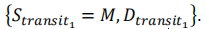，入侵者将被视为来自第一条T1路由的源传输节点。值得注意的是，在这种情况下，没有考虑表示攻击的一组音轨的顺序。这意味着将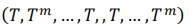识别为规范，将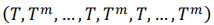识别为异常，也就是DoS攻击。
##### 作者再次选择了LSTM的体系架构，给出了最佳配置表。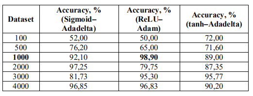 
##### 通过分析结果可知，这三种方法在训练基数足够大之后差距不大，所以使用了1000个训练数据集合、ReLU激活函数和Adam优化方法的配置可能是最佳的。

### 框架的组合：
##### 作者对选择的各种攻击方式都设计了对应的神经网络模型，也给出了推荐的优化配置。
##### 对于这些模型，作者希望将它们组合成一个可以检测复杂攻击环境的神经网络框架，具体的选取如下：
###### <ol><li>基于ReLU激活功能、Adam优化方法和5000个元素的训练数据集的LSTM ANN神经网络方法，用于检测黑洞攻击；</li><li>基于Sigmoid激活函数、Adam优化方法和5000个元素的训练数据集的LSTM ANN神经网络方法，用于检测灰洞攻击；</li><li>基于小波段激活功能、Adadelta优化方法和400个元素的训练数据集的小波段神经网络，检测蠕虫攻击；</li><li>基于ReLU激活功能、Adam优化方法以及可检测DoS攻击的1000个元素的训练数据集的LSTM ANN神经网络方法。</li></ol>
##### 下表显示了在涉及所有选用的神经网络且在输入处接收到相同大小的数据集的情况下测试神经网络框架的结果。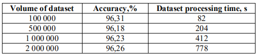 
##### 作者得出结论，该神经网络框架可以达到检测智能基础设施中动态路由网络上复杂攻击的需求。

### 
优点:

##### 作者在设计框架时，首先针对准确性的问题给出了自己的解决或者说是优化方案，划分为三个主要的，在我看来也是很有效的着手点：数据全面与否、拓展功能使用是否充分、方法效率是否优化。 在具体实施之前，对多种不同的神经网络进行优缺点分析并能给出实验论证。对每一种考量到的攻击手段设计采用不同神经网络体系的模型。分类讨论，十分合理。
### 
缺点:

##### 该论文在我看来也有很大缺点，首先，在设计和验证各种模型时的分析十分浅显、抽象，没有给出具体的操作和符号算数表示。其次，在组合整体框架的时候，只是给出了自己选取的进行了怎样优化的神经网络体系，并没有给出具体融合、解决矛盾的过程。但这也不是完全不可理解，因为本文出自于第十二届国际信息和网络安全会议论文集，并不是一篇来自实验室的文章。
### 
总结:

##### 作者通过检测网络中节点的正常或者异常活动及其对应的特征来开发用于检测以及保护的神经网络框架。在提高神经网络的检测准确性时，决定将重点放在3个部分：激活功能，优化方法和训练数据集的大小。ANN的准确性是检测攻击的保证。作者不仅对每种选定的攻击方式都设立了框架，而且对每个模型都进行了测试。显示每个ANN如何处理不合法的数据，以及ANN处理这些较大规模数据需要多长时间。最后组合检查神经网络系统框架，检测该系统是否能够针对动态路由中的复杂攻击进行检测。
##### 随着人工智能和物联网的发展，在不久的将来，在研究智能基础设施中的新型攻击时，可以通过借鉴这种方式并添加新的模块来检测新型的网络攻击。
##### 
但必须给出令人信服的实验证据。
