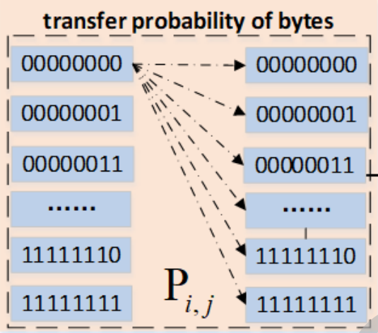
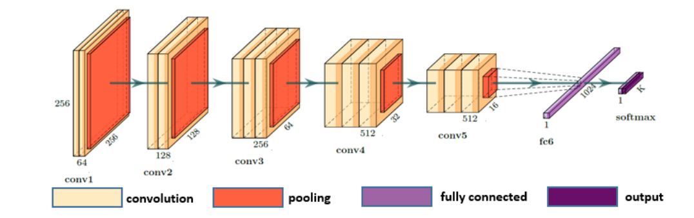
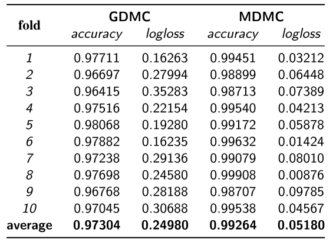
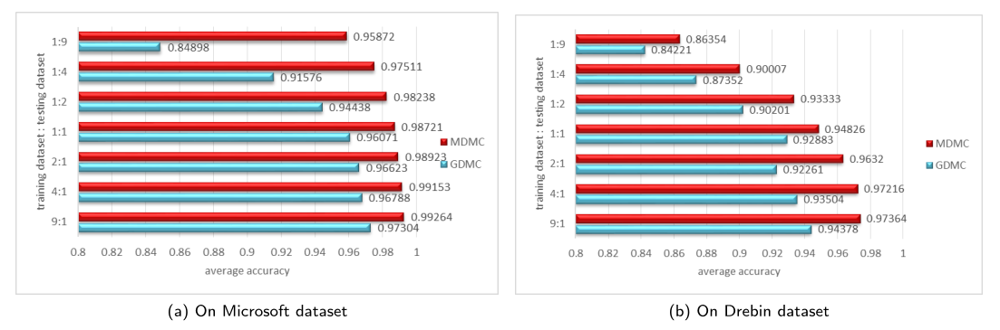
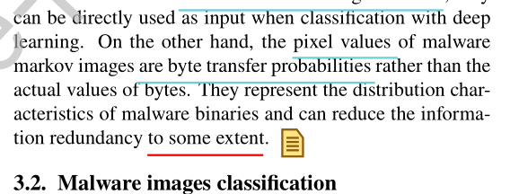

- 笔记作者：{AKA11}@Class1

- 原文作者：Baoguo Yuan , Junfeng Wang , Dong Liu , Wen Guo , Peng Wu and Xuhua Bao
- 原文题目：Byte-level Malware Classification Based on Markov Images and Deep Learning
- 论文类别：攻击智能检测
- 原文来源：Computers & Security

[TOC]

**概括**：随着深度学习技术的发展，传统的依靠机器学习的恶意软件静态分析方法被特征工程限制，深度学习逐渐成为更有效的方法，但是以前的主流技术gray images and deep learning (GDMC)严重依赖大量的数据集，并且精确率有待提升。本篇论文提出了**基于字节的一阶马尔可夫模型特征图恶意软件识别的卷积网络深度学习方法**（byte-level malware classification method based on Markov images and deep learning referred to as MDMC）可以优化GDMC。

### 1、研究内容

#### 1.1 构造Markov特征图

首先对二进制文件做字节上的统计，然后构造马尔可夫中的`状态转移矩阵`。

论文中的
$$
P(Byte_{i+1}\mid Byte_0.... Byte_i) = P(Byte_{i+1}\mid Byte_i)
$$
表明这是一阶的。
$$
p_{m,n}=P(n\mid m)=\frac{f(m,n)}{\sum_{i=0}^{255}f(m,i)}
$$
其中$f(m,n)$是频数。通过上式对转移概率$p_{m,n}$进行统计。

然后进行字节转换的统计：

进而构造出矩阵$\mathbf M$, $p_{m,n}\in \mathbf M$（但图中用的是$\mathbf P $）。

下图是原文中构造Markov图片的框图。

#### 1.2 模型

模型示意图：

这个网络并没有什么特别的，就是卷积加上全连接的分类器。论文作者将这个网络与VGG16进行对比，这个网络时间、空间都更高效。

这里不知道为什么他们的最后一层用的是`softmax`，按照玄学经验来说这里应该用`sigmoid`+`binary_crossentropy`。

#### 1.3 数据集

 the Microsoft dataset and the Drebin dataset.

#### 1.4 评估

由GDMC、MDMC的对比可以发现，MDMC很明显地提高了准确率且对数损失更低。

同时MDMC在Recall、F1-score上也比GDMC优秀。

下面的这个比较是为了证明MDMC在少量数据集的情况下也能表现得很优秀。

### 2、创新点

本文的主要创新点如下：

- 提出了新的恶意软件特征图的构造方法；
- 新设计的神经网络比VGG16更高效；
- 设计出的GDMC在多个指标下都比传统的MDMC优异。

### 3、论文评论

#### 3.1 个人认为的可以改进的地方

但是原文中论述传统方法的冗余性时提到的是

- 这个“to some extent”我觉得用在这里不太好，某种程度上是非常模棱两可的，没有给出直接的证明，或者将减少了多少冗余性具体化。

- Markov特征图统计的是所有字节（256种），没有先验的选择性，我想的话能不能统计经过挑选的字节，进一步减小输入模型的张量尺寸。
- 作者没有给出最后一层用的是`softmax`，而不用用`sigmoid`+`binary_crossentropy`的原因。

- 论文作者给出的模型并没有去试高级一些的网络如（ResNet, Inception等），可以尝试然后给出这个模型架构更优异的结论。

#### 3.2 给我的启发

##### 3.2.1 特征聚合 

本篇文章提出的新式的恶意软件特征图的构造方法是很巧妙的， 可以不完全损失信息地将二进制文件转换为固定大小的特征图。本篇论文中特地指出传统方法因为要提取文件特征，对于源信息的损害有点大。

这给了我很大的启发，因为自己也在做恶意软件的识别，用CNN，embedding设置了30000维，这里我觉得开销有点大，之后我将试验一下这样的方法能对我的模型有多大的提升，之前一直想把Hidden Markov Model用到我的设计中，这篇论文给了我很大的思路。

这并不是传统意义上的Hidden Markov Model，只是借鉴了其中状态转移矩阵的思想，在我看来，Hidden Markov Model还可以有更多的应用：
$$
\begin{array}.
P(y)&=\sum_{q_0}\sum_{q_1}\sum_{q_2}\dots\sum_{q_T}\pi(q_0)\prod_{t=0}^T b(y_t)\prod_{t=1}^T a_{q_{t-1}q_t}\\
&=\sum_{q_1}\sum_{q_2}\dots\sum_{q_T}\alpha(q_1)\prod_{t=1}^T b(y_t)\prod_{t=1}^T a_{q_{t}q_{t+1}}\\
&=\sum_{q_2}\dots\sum_{q_T}\alpha(q_2)\prod_{t=2}^T b(y_t)\prod_{t=2}^T a_{q_{t}q_{t+1}}\\
&...\\
&=\sum_{q_t}\alpha(q_t)
\end{array}.
$$

$$
\gamma(q_t)=P(q_t=z|y)，z\in\{Hidden\ Parameters\}
$$
如上式所述，Hidden Markov Model可用于估计$\gamma(q_t)$，而这样的估计让我想到能不能将$\gamma(q_t)$运用于构造特征矩阵$\mathbf G$，将字节转换概率矩阵在实数轴上的投影或者找其他的方法归纳为$\mathbf G$的一个元素，然后再挑选其他重要的特征组成$\mathbf G$。这样就构造出来更抽象的特征图，或许可以减轻模型、提高效率与准确率。

Hidden Markov Model整体上是一个前向传播与后向传播的结合，但是现在由于有了深度学习模型，使用非线性具有更高的表达能力，这样的归纳我不确定有什么样的效果。

##### 3.2.2 泛化

经典的Hidden Markov Model中：
$$
P(y)=\sum_{q_0}\sum_{q_1}\dots\sum_{q_T}\pi(q_0)\prod_{t=0}^T P(y_t|q_t)\prod_{t=1} ^TP(q_{t}|q_{t-1})=\sum_{q_0}\sum_{q_1}\dots\sum_{q_T}\pi(q_0)\prod_{t=0}^T b(y_t)\prod_{t=1}^T \mathbf A_{q_tq_{t-1}}
$$
这里$\mathbf A$便是这篇论文中的$\mathbf M $，这个$\mathbf A$值得学习。

这个构造转移矩阵图的方法不仅可以用在二进制文件的检测上，还可以用来检测恶意流量，如果是加了密的，只要加密方法不具有随机性，那么统计的方法还是可以通过构造马尔可夫转移矩阵进行检测。

