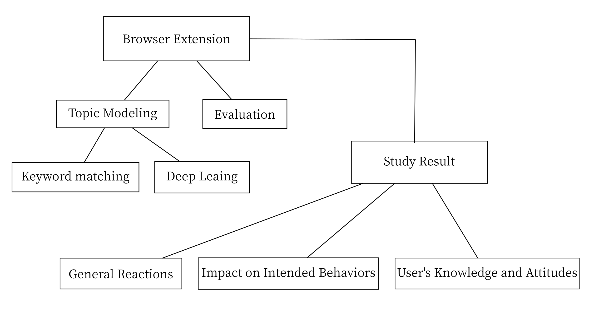
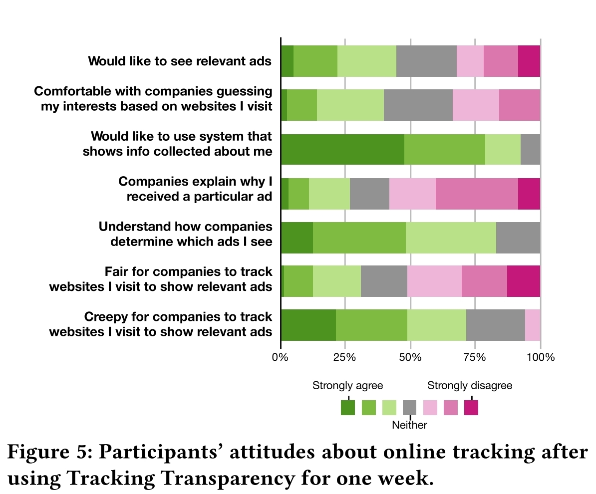

## 论文信息

### 标题

Oh, the Places You've Been! User Reactions to Longitudinal Transparency About Third-Party Web Tracking and Inferencing

### 作者

Ben Weinshel, Miranda Wei, Mainack Mondal, Euirim Choi, Shawn Shan, Claire Dolin, Michelle L. Mazurek, Blase Ur

### 出处和链接

[Article Link](https://dl.acm.org/doi/abs/10.1145/3319535.3363200)

CCS '19

### 笔记作者昵称

clearain 王清宇

## 论文简要

论文从Web网站对用户的追踪出发，将用户很大程度上是不清楚被追踪了的，或者说是不知道网站都对他的什么信息进行了追踪。现有的几款浏览器插件可以做到向用户展示有多少网站在追踪以及网站之间的关联图。本文设计了新的浏览器插件可以对追踪者追踪的深度进行分析和展示，并且找志愿者做了以周的实验，前后对比了志愿者最后在看到这些分析的用户画像后对隐私保护的态度。得出用户在使用这样透明化工具后更加想知道自己那些信息被搜集了同时也更倾向保护自己的隐私。

## 框图

## 主要内容

文章实现了新的浏览器插件来帮助人们认识到Web追踪的普遍性和内容，使用的Word2Vec技术实现关键字匹配以及双层LSTM神经网络进行机器学习训练来实现对话题的建模。以及使用准确度评估、精度和性能评估的方法调整模型，可以做到预测和判断被追踪者的兴趣爱好，当然这些都是为了更好的向用户展示透明的追踪结果。

志愿者们不管是之前是否有对网站的追踪有所了解，在问卷中都表现出了对跟踪范围和跟踪者数量的震惊，有的认为网站的隐私策略是不够完整的，对用户还是有所隐藏。但用户在广告投放方面希望通过跟踪系统学习用户兴趣的比例稍大，而用户选择直接告知广告客户其兴趣的比例较小，这有一些矛盾。这些结果都是基于对用户体验该插件一周后统计得到的结果，可以反映出人们对互联网追踪的看法，最开始都是震惊于深度和广度，但这些很大一部分都是网站追踪对用户不透明带来的后果，通过文章提出的插件可以帮用户更加清晰的认识网站的追踪。

本文的标题指出本文重点在于将追踪的内容透明的展示给用户后的反应，并且以图表的形式呈现了出来，这样对用户具有教育意义，用户可以更加明白网站对自己的信息探测到了哪种程度以及哪些追踪者在共享数据，对网站方或监管部门也有反向的作用要求他们对用户更加透明和规范。

## 创新点

解决了现在的隐私保护插件只是告诉你有哪些网站在追踪你但是对追踪的内容闭口不提的现象，这个插件的开发使用户更加明白自己哪些信息被追踪了，打破了行业和现状，用户的隐私保护需求需要得到满足，网站追踪也将对用户有能明确的透明度。

## 目前缺点

对于本文来说标题主要就是用户的反应而不是技术本身,后文提到的用户的局限性在于用户可能不会认真地完成使用后的调查问卷，这在一开始找志愿者时就可以避免比如当时就作一份调查看志愿者的态度，文章的图书馆式招募虽然可以获得更大的随机性但是实验的效果不能保证，为之后的信息筛选增加了难度。在之后的阶段将插件公开发布过后他们才能拥有更大的数据量，当然这些数据得明确告知用户正在被使用。
