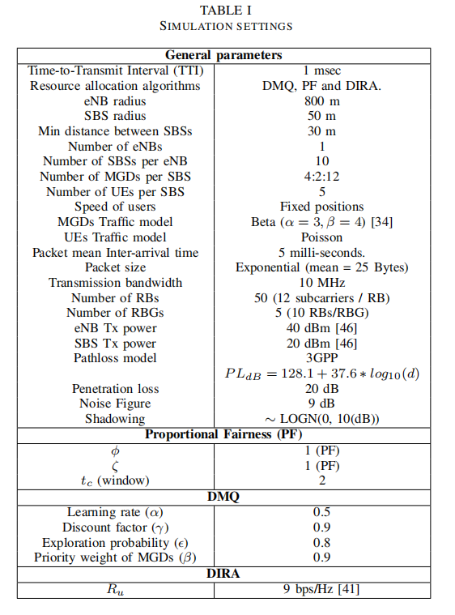
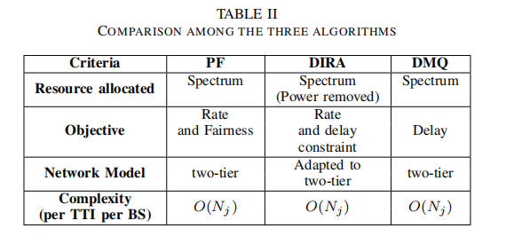

# Low-latency Communications for Community Resilience Microgrids: A Reinforcement Learning Approach 论文笔记 

## 基本信息: 

+ 标题: Low-latency Communications for Community Resilience Microgrids: A Reinforcement Learning Approach
+ 作者: Medhat Elsayed, Melike Erol-Kantarci, Burak Kantarci, Lei Wu, Jie Li
+ 刊物出处: IEEE Transactions on Smart Grid
+ 链接: [原文链接](https://www.researchgate.net/publication/334454684_Low-latency_Communications_for_Community_Resilience_Microgrids_A_Reinforcement_Learning_Approach)

## 主要内容总结:

1. 问题: 对于多个CRMS的集成控制和通信，大量的微电网设备需要共存。具有传统移动用户设备(UES)的ST，通常使用具有许多小单元基站(SBS)的自组织和密集的无线网络。在这种情况下，信息的快速传播变得具有挑战性。这就需要设计有效的资源分配和用户调度，以实现延迟最小化。

2. 解决方法: 本文介绍了一种资源分配算法，即Delay Minimization Q-learning (DMQ) 方案，该方案利用强化学习在每次传输间隔(TTI)中学习宏单元基站(eNB)和SBS的有效资源分配)。 与传统的比例公平性(PF)算法和基于优化的算法(即分布式迭代资源分配(DIRA))比较表明，我们的方案可以分别达到66%和33%的延迟降低率。 此外，DMQ在吞吐量方面优于DIRA和PF，同时实现了最高的公平性。
    
3. 具体实现: 
    + 小细胞网络
    
        我们的网络模型考虑了一个两层网络的eNB底层与小细胞基地站(SBS)覆盖用户设备。 资源分配过程是通过为网络中的活跃用户在时间和频域上确定最佳资源块来执行的, eNB和独立的SBS将RBs分配给每个TTI中的用户。在每个TTI中，用户向其附加的基站报告他们的调度请求(即用户向SBS报告，SBS向eNB报告)。 基站执行资源分配，并通知用户分配的RBs在下一个TTI中使用。 在两层网络(即eNB和SBS)上执行资源分配可以减轻eNB和facili的负担，以及促进小细胞的能力和覆盖范围的提高。
    + 单通道模式

        节点之间的无线信道可能容易出现多个衰落源，我们使用3GPP路径损失模型。
    + 通信模型

        我们遵循3GPP TR 37.868提出的机器型通信(MTC)的流量模型，在每个节点上应用Beta/M/1队列。

4. 效果:

    +  表一总结了用于评估所提出的算法和基线算法的仿真参数设置，平均超过5次测试后确定结果，每次运行为500个子帧。所有的模拟结果都提供95%的置信区间。
        - 

    + 表二是三种算法比较后的结果图

        - 
## 创新点:

1. 提出的资源分配算法，实现微网器件(MGD)的低延迟

2. 通过有效的奖励功能实现UE的低延迟。

3. DMQ在SBS和eNB上以分散的方式运行，用于两层调度，这有利于网络的敏捷性和自组织性。

## 缺点分析:

+ 没有background部分，将DMQ与其他几种模型(Criteria, PF, DIRA)比较时，缺少对已有方法的介绍.

+ 文章中有多处出现，"我认为"、"比较好的效果"等词组，没有使用真实数据来支撑，缺乏严谨性

