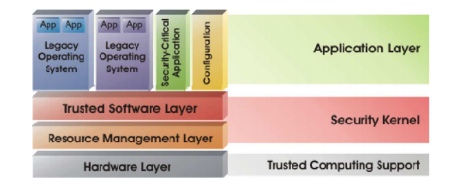
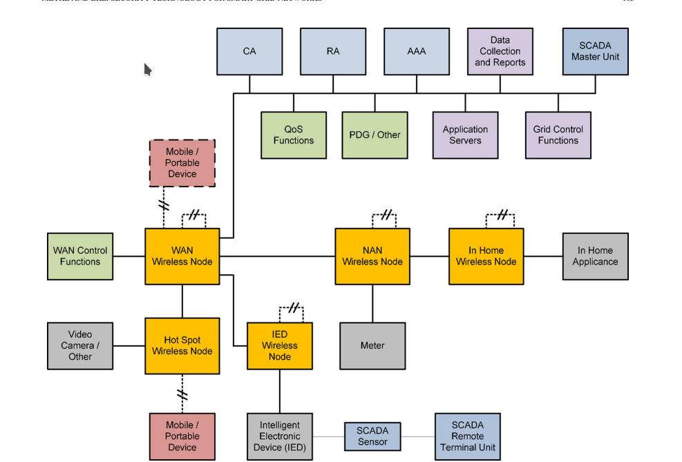

# Security Technology for Smart Grid Networks(论文笔记) 

## 基本信息: 

+ 标题: Security Technology for Smart Grid Networksregularization
+ 作者: Metke, A.R.，Ekl, R.L.
+ 刊物出处: IEEE TRANSACTIONS ON SMART GRID, VOL. 1, NO. 1, JUNE 20
+ 链接: [原文链接](http://feihu.eng.ua.edu/NSF_CPS/year1/w12_3.pdf)

## 主要内容总结:

1. 问题: 智能电网系统和网络的新功能（例如分布式智能和宽带功能）可以大大提高效率和可靠性，但是如果不部署适当的安全控制措施，它们还可能会创建许多新的漏洞。 为如此大的系统提供安全性保护非常困难，如果操作不当，可能会导致更多的网络攻击。

2. 解决方法: 提出一种智能电网的安全解决方案，该解决方案在很大程度上利用了公钥基础结构（PKI）技术和受信任的计算技术，相关解释如下: 
    
    + PKI技术元素（例如证书生命周期管理工具，信任锚安全性和属性证书）是可以专门针对智能电网网络进行定制的已知技术。
    + PKI解决方案支持受信任的计算元素，包括设备证明。

3. 具体实现:

    + KPI:
        与安全资源[aka信赖方(RP)]进行通信的证书主体应该从向RA发送证书签名请求(CSR)开始。RA执行审核功能，该功能确定请求的绑定是否正确，如果签名正确，则签名CSR并将其转发给CA，然后由CA颁发证书。稍后，当证书主体希望访问安全资源时，它将证书发送给RP。RP通常通过向验证机构（VA）请求证书状态来验证证书，该机构会在证书有效时做出肯定答复
        相关标准在下面详细解释
        - Smart Grid PKI Standards:
        - Trust Anchor Security
        - Certificate Attributes 
        - Smart Grid PKI Tools
    
    + 可信机制:
        
        - 计算机基础可信模型如下
        
        - 智能电网详细的逻辑模型如下
        
        
        - 安全组件包括
            + Overall Architecture
            + Wireless Networks
            + Incident Response Plan
            + Device’s Scope of Influence

4. 总结: 
    + 作为关键的基础架构元素，智能电网需要最高级别的安全性。从一开始就需要内置安全性的综合体系结构。
    + 智能电网安全解决方案需要整体方法，包括基于行业标准的PKI技术元素和可信计算元素。
    + 智能电网安全性需要有一套紧密的要求和标准，同时设计标准应具有较长的生命周期

   
## 创新点:

1. 以公钥基础结构（PKI）技术以及受其他架构组件支持的受信任计算元素来解决根据智能电网的安全要求以及系统的规模和所需的可用性。

2. 通过建立基础的可计算模型，涵盖电网操作的几乎所有方面，用以抵御超大规模架构和网络攻击的潜在威胁

## 缺点分析:

1. 标题是Security Technology for Smart Grid Networks，太过宽泛，我认为应该更加具体，比如: 基于PKI和可信计算的智能电网防御
2. 介绍部分篇幅过多，囊括智能电网安全的所有分类，但本文提出的解决方法只是某一分类下的具体实现，我认为可以缩小其他分类的篇幅
3. 文章的写作风格不够书面化，(我认为，我们以为)这种说法不够可信
4. 文章对于该技术的实践效果没有明确说明，且缺少公式推理过程

