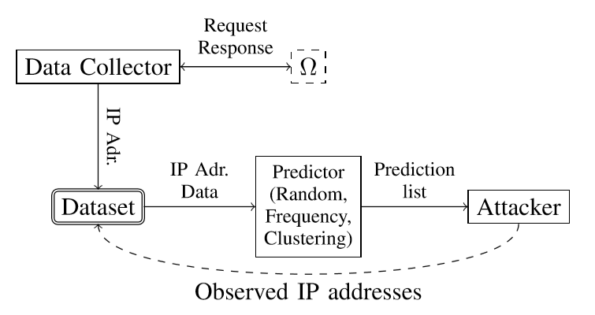
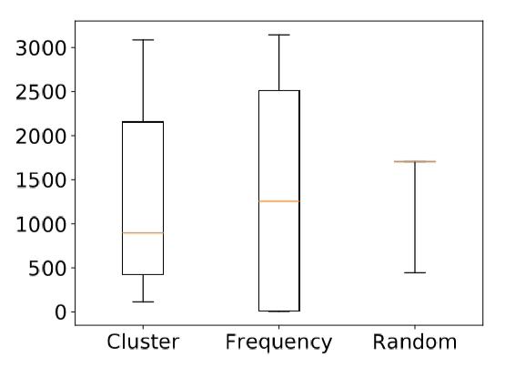

# Predictability of IP Address Allocations for Cloud Computing Platforms 笔记

- 论文标题: Predictability of IP Address Allocations for Cloud Computing Platforms
- 论文作者: Hyun Kwon and Yongchul Kim and Hyunsoo Yoon and Daeseon Choi
- 论文出处: IEEE Trans. Information Forensics and Security
- 论文链接: [Here](https://ieeexplore.ieee.org/abstract/document/8744277/)
- 笔记作者: 缪昌伟

## 论文简要

使用网络地址随机化是在云平台对抗DDos攻击的有效途径之一, 但这一手段是建立在攻击者完全无法进行IP预测的前提下的。该论文通过对两家主流云服务商的相关产品的随机IP进行长期采集何数据分析，证实了实际云服务商提供的随机IP分配器的熵是有限且不足的。同时，该论文提出并评估了用于生成IP预测序列的3个数据模型（分别基于频率、聚类何马尔科夫过程）。

## 论文框图

## 主要内容

### 数据收集

对AWS(Amazon Web Services)何GCP(GoogleCloudPlatform)的多个销售区实行了长达数周的IP收集(策略不同)

#### Amazon Web Services

AWS允许单实例最多5IP关联，论文作者在多个销售区域进行了反复的IP分配。

#### GoogleCloudPlatform

GCP单实例限制单IP，论文作者通过反复销毁并重创建实例来获取随机IP序列。

### 数据分析

该论文在对收集到的数据进行分析时，主要考虑了下列方面

- IP数量和前缀
- 完整性（在一个时间段内覆盖该平台所有可能的3字节前缀）
- 频率分布
- 信息熵（不是很明白这里的信息熵代表了什么）
- 重复速率

### 攻击模拟

该论文使用3种不同的预测算法（聚类、频率和随机）实施攻击模拟，并统计了攻击命中次数。经分析，除了随机算法效果较差之外，另外两类算法均取得了90%以上的命中率。

## 创新点

本质上来说，该论文利用了伪随机算法熵池局限性。使用统计学手段，实现了对与服务商提供的随机IP序列的有效预测，为DDos攻击提供了新的辅助手段。

## 局限性

- 本质上仍然是统计学的应用，方法上并无重大突破
- 局限于IPv4
- 数据(IP序列)收集手段单一
- 研究对象受限，可能无法代表普遍情况下的IP分配行为
