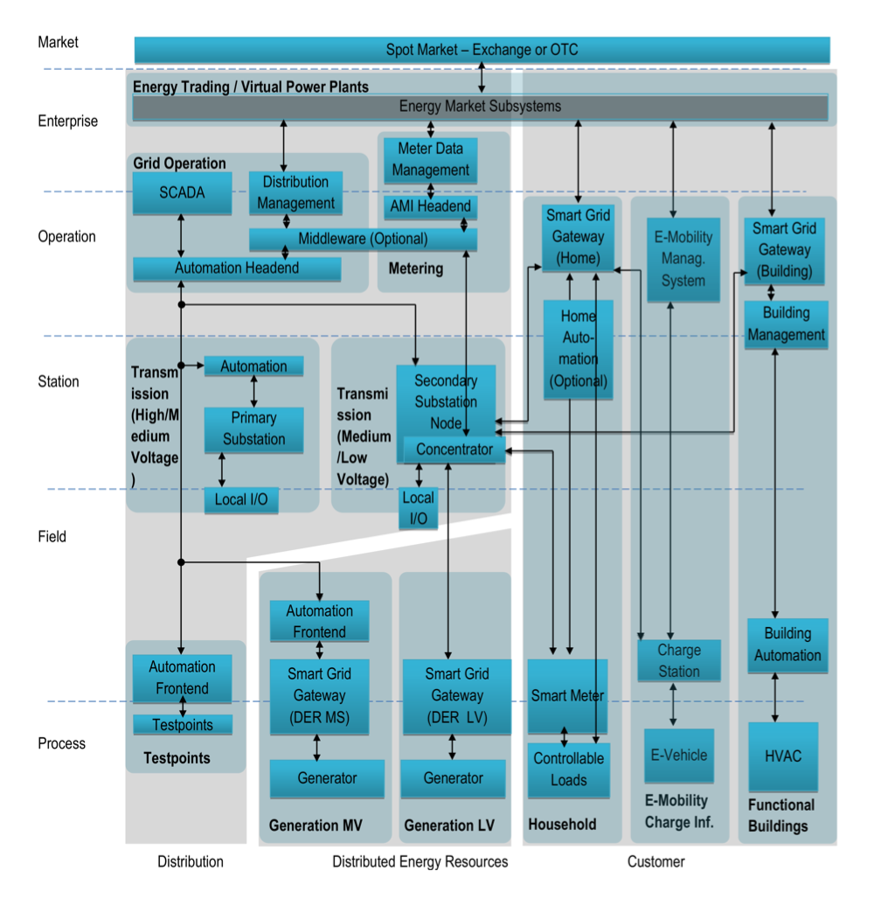

# 论文笔记
## 论文信息

* 标题：Architecture-Driven Smart Grid Security Management
* 作者：Markus  Kammerstetter, Lucie Langer, Florian  Skopik, Wolfgang  Kastner
* 出处：IH&MMSec '14: Proceedings of the 2nd ACM workshop on Information hiding and multimedia security
* 链接：https://dl.acm.org/doi/abs/10.1145/2600918.2600937
* 笔记作者昵称：hlr

## 论文简要

智能电网的使用伴随着ICT技术的广泛应用，ICT技术的使用会存在网络安全攻击的风险，会对智能电网造成负面影响，因此需要对这些风险进行评估，确保智能电网的安全。文章中提出了一种以整体架构为基础的安全管理方法，并且和现有的公司一起验证了整个过程的实用性。  

## 主要内容

现代智能电网，每个人都可以成为能源的生产者，对于大型的能源厂商来说，分散的能源生产导致能源网络不能再被集中控制。这其中的解决方案就是通过建立一个与电网并行的ICT网络，将现有的电网升级为智能电网。虽然这样可以更好的利用电力，但是也引入了新的安全风险，带来毁灭性的影响。  

因此作者没有从单一的技术层面来解决问腿，而是通过提出一种新的架构驱动的结构模型来解决可能出现的安全问题。  

文章当中，主要贡献一共有三点：

>1. 基于SGAMB的智能电网模型，代表了当前和未来不久的欧洲智能电网架构
>2. 智能电网的网络安全危险的全面目录
>3. 一种实用的风险评估方法，能够在高级架构视图和特定的技术安全措施之间架起桥梁

### 智能电网风险管理方法

该部分介绍了风险管理的五个步骤，如下：

>1. 体系结构建模  
>2. 风险识别  
>3. 风险评估
>4. 风险缓解
>5. 合规检查

### 智能电网的架构模型

文中提出了一个详细的架构模型，如下：

  

通过该架构，可以建立一套有效的安全智能电网系统

## 创新点

该论文针对不仅仅是某一个小点进行技术上的改进，而是从宏观的角度提出了一个整体的架构和一种新的风险管理策略，在这种重要的工业系统中，显得尤为重要。

并且论文当中的方法都有与工业界保持密切联系，经过了工业界中的验证，保证了其中论述的方法的可用性，而并非假大空的谈论相关内容，值得借鉴。

## 目前缺点

智能电网属于一个不断发展的新兴产业，因此各种技术正在蓬勃发展，该方案可能在未来进一步发展后不再适用，并且各国的情况不尽相同，该论文是产于欧洲，所以对欧洲的智能电网发展有影响作用，但是若想要推广，可能还需要进一步改进

### 改进方法

1. 对于文章中所提到的智能电网模型，由于各国发展的不同，因此可能都会有不同的架构，而不同的架构之间就会有不同的安全问题，文章中的解决方案主要针对于欧洲，而若需要解决不同的系统之间的安全问题，可以借鉴该文章中的部分观点，然后根据实际情况进行相应的改进
2. 文章中提到的风险管理策略，可以根据不同的公司来进行相关的改进，但是整体来说仍有很高的指导意义

