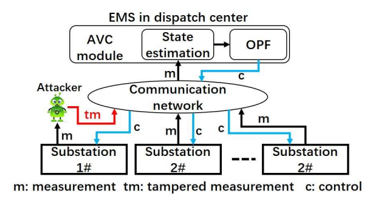
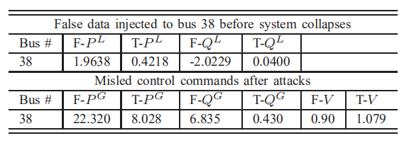

- 原文标题：Evaluation of Reinforcement Learning-Based False Data Injection Attack to Automatic Voltage Control
- 原文作者：Ying Chen, Shaowei Huang, Feng Liu, Zhisheng Wang, Xinwei Sun
- 原文出处：DOI 10.1109/TSG.2018.2790704，IEEE Transactions on Smart Grid
- 链接：https://ieeexplore.ieee.org/document/8248780
- 笔记作者：张颢

#### 1. 研究内容

​	本文意图使用强化学习等学习算法模拟虚假数据注入的攻击过程得到最优的攻击策略，并且制定了不同的攻击方法进行验证，提出了一种基于KDE的检测和校正方法来减轻虚假数据注意攻击造成的影响。

​	本文研究了新型的虚假数据注入过程并调查此攻击对自动电压控制系统的影响。首先，攻击者使用基于数据驱动的在线学习策略，将攻击策略建模为部分可观测的马尔科夫过程，通过强化学习帮助攻击者获得近似最优策略，对自动电压控制系统(AVC)进行攻击。

利用AVC对电力系统进行FDI攻击的过程

​	评估不同攻击的效果，分析相应的数据。

攻击前后的数据记录

​	最后提出响应的检测对策，分析攻击和对策具有的特点。

#### 2. 创新点

​	本文提出了一种新型的FDI攻击方法，它可以影响电力系统的正常运行。攻击者运用强化学习、最近记忆Q学习方法来获取有效的攻击策略。测试结果也表明通过此种攻击方法一些变电站在某些情况下可能产生电压崩溃的状况。而且，在线学习的方法也可以自动选择攻击的时刻来保证攻击的隐蔽性，是一种切实有效的攻击方法。同时，也提供了一种不良数据的检测和校正方法来抵御此种攻击。

#### 3. 缺点

​	这是一种非常稀疏的攻击方法，可能要选择特定的变电站来保证它的效用。另外，没有讨论基于病毒传播的攻击方法，也没有提出更有效的反制措施。

#### 4. 替代方案或改进方法

1. 考虑攻击期间数据大小对攻击的影响。可以利用大规模的测量估计状态来适当调整一些参数。
 	2. 学习策略的最优解选择。模拟过程中只有限数量的跟踪和误差被检测到，可能数据不足以让攻击者采用最优策略。因此，攻击者的观测范围会变窄，可以使用在线强化学习的方法来帮助攻击者重用有效的攻击。
 	3. 当系统扩展时，攻击特定的变电站可能会变得困难，可以考虑扩展攻击方法。