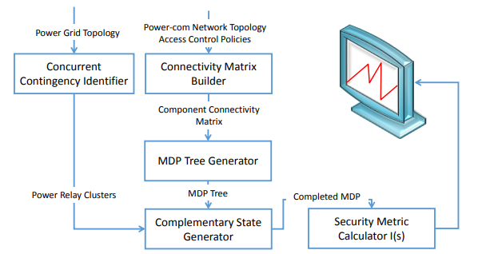

# 论文笔记
* 论文标题：CASeS: Concurrent Contingency Analysis-Based Security Metric Deployment for the Smart Grid
* 论文作者：Parisa Akaber, Bassam Moussa, Mohsen Ghafouri, Ribal Atallah, Basile L. Agba, Chadi Assi, Mourad Debbabi
* 论文出处：IEEE Transactions on Smart Grid, vol. 11, no. 3, pp. 2676-2687, May 2020.
* 论文链接：[文章链接1](https://ieeexplore.ieee.org/document/8933085) ，[文章链接2](https://sci-hub.im/downloads-ii/2019-12-27/ff/10.1109@TSG.2019.2959937.pdf?rand=5eb01ad2e5f07?download=true)
*  笔记作者：nanaY
## 论文笔记信息
**1. 研究背景**  
目前我们的电网正见证着向更智能、更强大的方向发展。引入其的目的是为了通过提供更可靠，可用和有效的发电，输电和配电网络来增强电网的当前状态。而安全度量部署对于电力公用事业至关重要，尤其是在未来的智能电网中，尽管安全评估技术在过去的十年中已广泛部署在IT领域中，但这些解决方案在解释系统动态以及解决智能电网安全性和功能实时性要求方面尚不足。为智能电网量身定制的安全性指标有望从系统操作中得出知识，并从已部署的安全监控解决方案中实时获得警报，以暴露针对电网的威胁，并量化整体系统安全性。所以在本文中，作者提出了一种基于权变分析的智能电网系统安全评估框架-CASeS。  
**2. 论文主要工作**  
在本文中，作者团队基于对智能电网的并发偶发性分析定义了安全度量（CASeS）。其指标将网络安全分析与智能电网的硬件在环（HIL）仿真相结合，并根据电力系统动态和部署在不同电网级别的入侵检测系统生成的警报，利用并发突发事件来评估系统关键性级别。CASeS通过从测量和报告中推断出的实时洞察力为公用事业提供支持，并允许在系统级别预测并发突发事件的后果。  
作者团队定义的CASeS框架包含以下组件：网络物理模型、威胁模型、连接矩阵构建器、MDP状态树生成器、并发应变标识符、互补状态发生器、安全指标计算器，将上述组件组合，构成如图所示CASeS架构  
  
且如图所示。基于电源和通信网络拓扑，CASeS广泛地扫描组合的网络物理组件，并识别并发突发事件。 CASeS使用随机马尔可夫决策过程枚举系统安全状态，使用互补状态生成器识别具有多个受损组件的状态，并为那些状态分配相关索引以反映其严重程度。  
CASeS安全指数量化了网格的关键级别，并反映了系统的安全状况。通过CASeS收集的结果可用于定义存在网络攻击时的系统保护纠正措施。作者已经在不同的IEEE测试系统上演示了CASeS功能。  
**3. 创新点**  
本文创新点在于：  
①将网络安全分析与HIL仿真相结合，以识别和制定电力系统的网络物理并发突发事件。  
②采用马尔可夫决策模型并结合电网协同仿真方法实时反映智能电网的安全态势，并针对智能电网进行网络物理安全度量及其计算。  
③量化网格安全状况，说明不同网格状态的关键程度以及基于收集的安全警报和报告的智能电网安全智能推断。  
**4. 存在问题**  
本文介绍的CASeS框架作用于智能电网中的覆盖面还很低，其主要工作重心在于广域监视系统（WAMS）的安全量化方面。  
**5. 个人观点**  
作为未来智能电网目标，该框架应扩展定义的指标以覆盖智能电网的其他组件。