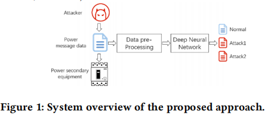
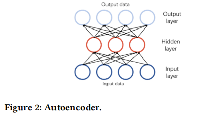
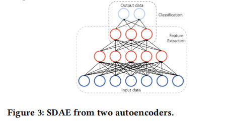

###### 论文赏析
##### 论文题目：Cyber-Attack Classification in Smart Grid via Deep Neural
利用深度神经网络在智能电网中进行网络攻击分类
===
###### 作者：Liang Zhou,Xuan Ouyang,Huan Ying,Lifang Han,Yushi Cheng,Tianchen Zhang
###### 出版物：CSAE '18：第二届国际计算机科学与应用工程国际会议论文集2018年10月 
###### 链接:https://doi.org/10.1145/3207677.3278054
### 主要内容总结：
##### 随着网络和通信技术的发展，虚拟化与物理过程之间的联系越来越密切，智能电网就是产物之一。但是这种模式在带来高效率的同时，也带来了黑客通过网络手段破坏电网生产的威胁。因此需要对可能遭受的种种网络攻击进行识别分类，为下一步防御做准备。
##### 作者首先分析了智能电网中可能发生的网络攻击，在前人的基础上设计了一种新颖的基于深度神经网络的智能电网入侵检测系统。配置了合适的全局参数实现较高的泛化性能。评估结果表明，该方法可以有效识别智能电网中的网络攻击，准确率高达96％。
### 论文主要创新点和优点：

##### 作者提出了一种利用历史攻击数据来构建深度神经网络模型来为智能电网进行网络攻击分类的新颖方法。采用SDAE（堆叠式自动编码器）网络结构来挖掘攻击消息的内在特征，并优化网络以实现高鲁棒性和泛化性能。在实验后半部分还与之前的方案进行了对比、优化，得到合适的参数。论文的结构也很明确，设定了自己合理的评估指标。

### 论文缺点：
##### 总体来说我觉得这篇文章还是很优秀的。要说缺点的话，对我个人而言，可能稍显不足的是，中间第三部分在进行系统设计的文章核心部分，图解不是特别详细，看起来略显吃力。

### 改进建议：（仅代表个人观点）
##### 作者在第三部分首先分析了智能电网可能遭受的网络攻击手段和具体受影响的部位。此处我觉得可以给出一个包涵主要工作部位的智能电网的示意图，方便读者深入了解提到的这些攻击手段的具体工作原理和路径。 作者方案中提到的创新方法有一个主要方面是在入侵检测框架中使用了SDAE网络结构，这是一个多层次的编码器，我觉得作者也可以在相应的文字说明部分加上一个分层的示意图，能够更加直观明了、锦上添花，也方便理解后面系统设计部分的说明。
