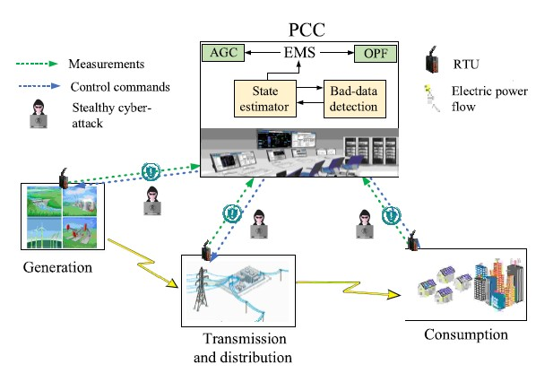
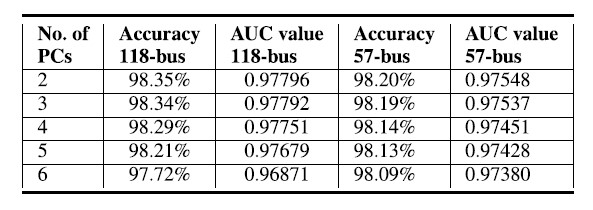

- 笔记作者：@Xiaoyu Xue

- 原文作者：MARIO R. CAMANA , SAEED AHMED , CARLA E. GARCIA , AND INSOO KOO

- 原文题目：Extremely Randomized Trees-Based Scheme for Stealthy Cyber-Attack Detection in Smart Grid Networks

- 原文来源：IEEE ACCESS 2020

  在智能电网中，黑客可以注入传感器一些错误的测量值用以欺骗和破坏数据检测器，导致经济损失、网络中断等问题，危及智能电网的安全。本文提出了一种基于极端随计划树算法和主成分降维分析的网络攻击检测新方法。

#### 1、研究内容

隐形网络攻击：下图展示了智能电网通信网络中隐形网络攻击结构。

数据集：该数据集由历史active power flow measurements和active power
injections into the buses组成，这些数据是在电网的PCC处收集的。采用了SE-MF数据集。

算法流程：extra-tree分裂算法流程如下：

评估结果：模型的检验是在IEEE 118总线和57总线系统中。KPCA技术在这两者之中的评估结果如下表：

#### 2、创新点

本文的主要创新如下：

- 阐述了BDD为何不适用于抵抗传统电力系统上的攻击
- 提出了非线性降维方法
- 采用标准IEEE 57总线和118总线测试系统进行验证

#### 3、论文评论

本文提出了基于DR的智能电网SCA攻击的机器学习框架，并利用KPCA技术将数据降维。通过考虑被噪声标签损坏的训练数据，评估了一个更现实的场景，此方案对噪声标签提供了极大的帮助，主要是因为KPCA在执行降维时没有考虑标签，而额外树算法可以通过调整子节点中执行分割所需实例的最小数量的参数来处理噪声标签。