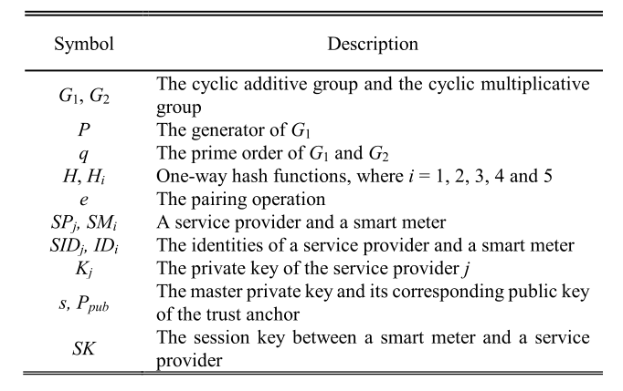
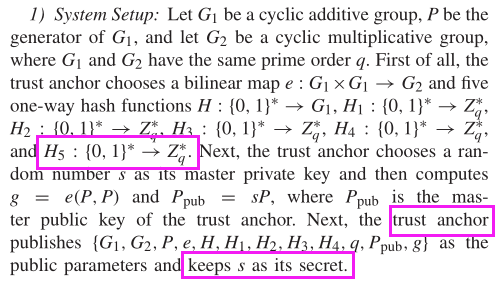
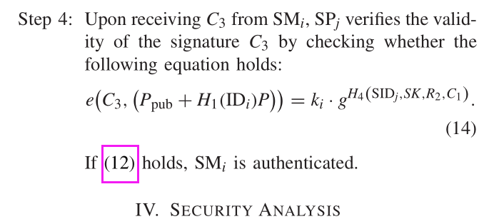
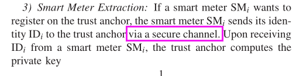
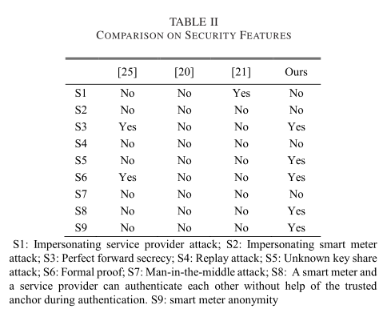

- 笔记作者：{AKA11}@Class1
- 原文作者：Jia-Lun Tsai and Nai-Wei Lo, Member, IEEE
- 原文题目：Secure Anonymous Key Distribution Scheme for Smart Grid
- 论文类别：密码学、智能电网安全
- 原文来源：IEEE TRANSACTIONS ON SMART GRID, 2016

[TOC]

### 1、研究内容

使智能电表与服务提供商之间能够进行匿名化的安全通信。

#### 1.1 问题引入

为了使智能电表与服务提供商之间能够进行安全通信，认证密钥管理成为一个重要的安全问题，近年来提出了几种关键的分布式方案。但这些方案**不支持智能电表的匿名性**，存在安全隐患。

#### 1.2 解决方案

方案涉及三方面：**可信密钥分发者，智能电表，服务提供商**。其中可信密钥分发者只在初始化密钥的时候参与，其余的密钥协商阶段等都不用参与进来。

##### 1.2.1 综述

将问题引入到阶均为$q$的循环加群$G_1$与循环乘群$G_2$，引入函数$e$使
$$
e:G_1\times G_1 \rarr \ G_2
$$
同时，$P$是$G_1$的生成元，$g$是$G_2$的生成元。

其余符号如图所示：

**补充**：

$g = e(P,P)$，

$s、a_i、b_i、N_C$是随机数，

$q_i = H_1(ID_i )$，

$ P_{\mathbb{pub}} = sP  $。

##### 1.2.2 初始化阶段

可信密钥分发者选择随机数$s$作为它的主私钥，然后计算$g = e(P,P)$和$ P_{\mathbb{pub}} = sP $，其中$ P_{\mathbb{pub}} $是可信密钥分发者的主公钥。

可信密钥分发者公布$\{G_1, G_2,P,e,H, H_1, H_2, H_3, H_4,q,P_{\mathbb{pub}},g\} $作为公共参数，注意这里并没有公布主私钥$s$。

初始化阶段完成，可信密钥分发者不用参与后面的事情了。

**接下来的计算有些繁琐，而且符号多，可以参看之前的符号表及其补充，并且后面会对重要公式进行解释。**

##### 1.2.3 电表$i$与服务提供商$j$密钥协商阶段

###### 1.2.3.1 First Step

电表$i$计算
$$
C_1=a_i·(P·H_1(SID_j)+P_{\mathbb{pub}})
$$

$$
C_2=H_2(g^{a_i},SID_j)\oplus(ID_i,N_C)
$$

然后将$C_1,C_2$发送给服务提供商$j$。

**解释**

注意$(3)$式中的不是表示$H_2$有两个参数，可以理解为$(g^{a_i},SID_j)$组成了一串二进制经过哈希然后与$(ID_i,N_C)$组成的二进制进行异或。

###### 1.2.3.1 Second Step

服务提供商$j$计算
$$
k_i=e(\frac{1}{s+H_1(SID_j)}·P,C_1)
$$

$$
V_i=H_2(k_i,SID_j)
$$

$$
(ID_i,N_C)=C_2\oplus V_i
$$

$$
SK_j=H_5(b_iC_1)
$$

$$
R_1=b_i(P·H_1(SID_j)+P_{\mathbb{pub}}) \tag 8
$$

$$
R_2=H_3(q_i,q_j,N_C,ID_i,SID_j,SK)
$$

然后发送$R_1,R_2$给电表$i$。

**解释**

计算$(4)$：
$$
\left. \begin{array} .k_i\\=e(\frac{1}{s+H_1(SID_j)}·P,C_1)=e(\frac{1}{s+H_1(SID_j)}·P,a_i·(P·H_1(SID_j)+P_{\mathbb{pub}}))\\=e(P^2,a_i)=e(P,a_iP)=e(P,P)^{a_i}=g^{a_i}\end{array}\right.
$$
即得到$k_i=g^{a_i}$。

计算$(6)$：
$$
\left. \begin{array} .C_2\oplus V_i\\=H_2(g^{a_i},SID_j)\oplus(ID_i,N_C)\oplus H_2(k_i,SID_j)\\
=H_2(g^{a_i},SID_j)\oplus(ID_i,N_C)\oplus H_2(g^{a_i},SID_j)=(ID_i,N_C)\end{array}\right.
$$

###### 1.2.3.1 Third  Step

电表$i$计算
$$
SK_i = H_5(a_i·R_1)
$$

$$
R_2=H_3(q_i,q_j,N_C,ID_i,SID_j,SK)
$$

$$
C_3=(a_i+H_4(SID_j,SK,R_2,C_1))·(\frac{1}{s+H_1(ID_i)}·P)
$$

然后将$C_3$发送给服务提供商$j$。

**解释**

对$(12)$来说
$$
SK_i = H_5(a_i·R_1)=H_5(a_i·b_i(P·H_1(SID_j)+P_{\mathbb{pub}}))
$$
与
$$
SK_j=H_5(b_i·C_1)=H_5(b_i·a_i·(P·H_1(SID_j)+P_{\mathbb{pub}}))
$$
可以看到，这里完成**密钥对合（协商）**，实现了$SK_i=SK_j$。

###### 1.2.3.1 Fourth  Step

服务提供商$j$计算
$$
e(C_3,(P_{\mathbb{pub}}+P·H_1(ID_i)))=k_i·g^{H_4(SID_j,SK,R_2,C_1)}
$$
协商完成。

**解释**

对$(16)$来说
$$
\left. \begin{array} .e(C_3,(P_{\mathbb{pub}}+P·H_1(ID_i)))\\=e((a_i+H_4(SID_j,SK,R_2,C_1))·(\frac{1}{s+H_1(ID_i)}·P),(P_{\mathbb{pub}}+P·H_1(ID_i)))\\=e((a_i+H_4(SID_j,SK,R_2,C_1)),\frac{P_{\mathbb{pub}}+P·H_1(ID_i)}{s+H_1(ID_i)}·P)\\=e((a_i+H_4(SID_j,SK,R_2,C_1)),P^2)=e(P·(a_i+H_4(SID_j,SK,R_2,C_1)),P)
\\=e(P,P)^{(a_i+H_4(SID_j,SK,R_2,C_1))}=g^{a_i}·g^{H_4(SID_j,SK,R_2,C_1)}=k_i·g^{H_4(SID_j,SK,R_2,C_1)}
\end{array}\right.
$$

#### 1.3 方案基础

这个方案建立在三个数学难题上：

- Collusion Attack Algorithm With k-Traitors: k-CAA Problem

- Computational Diffie-Hellman Problem: CDH problem

- Modified Bilinear Inverse Diffie-Hellman With k Values Problem: k-mBIDH

  

#### 1.4 评估

这个方案支持认证和智能电表匿名，并且证明了该方案在随机oracle模型下是安全的。

### 2、创新点

本篇论文提出了一种新的安全密钥分配方案。该方案允许智能电表通过一个私钥匿名访问服务提供商的服务。该方案采用基于身份（$ID_i$与$SID_j$）的密码体制，在不需要可信密钥分发者的情况下，智能电表可以被服务提供商快速识别。

最重要的是，与其他现有方案不同，该方案支持相互认证和智能电表的匿名。

### 3、论文评论

#### 3.1 个人认为的可以改进的地方

##### 3.1.1 论文可能打错的地方

本篇论文，我觉得好像作者在把服务提供商与可信密钥分发者混着用，因为原文中

的$H_5$是可信密钥分发者没有发布的，但是在计算$SK_i$与$SK_j$的时候都使用了$H_5$，这点我是没有太明白的，或者说是作者的疏忽。因为我搜索了全文的`H5`都没找到$H_5$是公开的。

上图中的$(12)$我觉得应该是$(14)$。

##### 3.1.2 论文内容可以改进的地方

###### 3.1.2.0 伪造

这个算法不能防止伪造$ID_i$与$SID_j $。

###### 3.1.2.1 安全信道

在初始化的时候，还是需要一个理想的安全信道，这点可以想办法改进。

###### 3.1.2.2 符号

同时本篇文章中的符号太多了，与经典的ECDH密钥协商相比这显得非常地复杂。

同时符号还不说全....害得自己花时间去找。

###### 3.1.2.3 安全性对比

和其他密码对比：

它们都不能抵御重放、中间人攻击。

#### 3.2 提出一些建议

##### 3.2.0 使用主私钥对抗伪造

论文中的主私钥没有怎么派上用场，那么这里就可以使用主私钥对$ID_i$与$SID_j $进行签名，然后在算法中添加验证的部分。

当然，为了匿名的考虑，这里的主私钥可能需要另外生成，并且将公钥直接写在电表的硬件里，这样就可以避开在线验证。

##### 3.2.1 在不安全信道下通讯

或许可以考虑**Shamir三次传递协议**。Shamir三次传递协议可以实现无需预先交换任何秘密密钥或公开密钥就可进行保密通信。

但是该协议的关键在于找到一个安全的可交换的加密算法，虽然存在很多可交换的加密算法，但它们中绝大多数是不安全的。

##### 3.2.2 引入新的数学工具降低符号负担

就像使用费马平方和定理得到的推论：$p=4k+1$的可以分解为$p=(a+bi)(a-bi)$，增加了分解基的大小，引入数域加速平方筛法的第一步一样。

如果密码体制引入新的工具，或许可以有更优异的表现。

在经典的ECDH中，

A生成秘钥$k_1$, 得到$s_1=k_1G$, 公开$s_1$

B生成秘钥$k_2$, 得到$s_2=k_2G$, 公开$s_2$

A拿到$s_2$,进行计算$k=k_1(k_2G)$

B拿到$s_1$,进行计算$k'=k_2(k_1G) $

由于椭圆曲线中基点$G$前的系数乘法实际上是加法，椭圆曲线上点的加法满足交换律,所以$k_1k_2=k_2k_1$

得到$k=k'$,此时A、B拥有相同秘钥$k$

上面的推导非常简洁，将问题引入到椭圆曲线中，或许可以更安全更简洁且同样实现认证与匿名。

##### 3.2.3 抵御中间人攻击

如果信道变得不安全，在考虑中间人攻击的情况下，或许可以考虑改进**连锁协议**，即在每次发送加密消息的的一半的基础上增加新的特性。

##### 3.2.4 抵御重放攻击

引入时间戳、递增序号、秘密约定。

时间戳要求通讯双方的时间不能差太久，这应该不难实现，递增序号在传送数据包的时候用。

对智能电表来说，若偶然出现不同步，则正确的信息可能会被误判为重放信息而丢弃，而错误的重放信息可能会当作最新信息而接收，这也是个问题，所以这个时候就需要递增的序号了，这个序号的初始化是事先商量好的，如果遇到重复序号的包那么就丢弃。

虽然密码学一直强调“一切秘密寓于密钥中”，但是在防止重放攻击上，可以考虑使用秘密约定的哈希函数，增大重放攻击的难度。

##### 3.2.5 私有协议

本质上来说，根据唯一解距离：
$$
n_u=\frac{H(\mathcal K)}{\log||\mathcal A||-H(\mathcal p)}
$$
各种加密算法，都是在增加破解的难度，增加$H(\mathcal K)$或者使$\log||\mathcal A||$接近$H(\mathcal p)$。

和上面的“秘密约定”的思想差不多，都是增大攻击的难度，因为只有一次一密的时候$\log||\mathcal A||=H(\mathcal p)$，私有协议可以更接近这一点。

