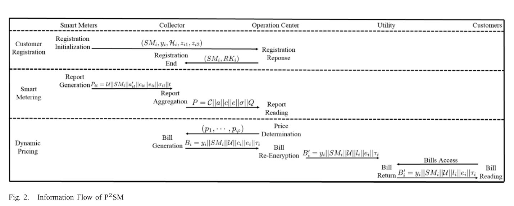

## 论文主要内容

论文从现在智能电网存在的问题出发，首先讲述了现在智能电网使用的系统模型和安全模型，分析了其中攻击者可能进行的攻击方式，包括窃听、假数据注入攻击、数据篡改重放等。

提出了他们的P2SM解决方案，能够在保证不给网络带来更大负担和能够动态生成账单的情况下进行数据的鉴权、用户隐私的保护和完整性确认，接着是具体的方案细节和安全性的分析评估，最后和现在的方案对比他们提出的新方案性能和安全性上都更有优势。

## 论文基本信息

### 标题

Balancing Security and Efficiency for Smart Metering against Misbehaving Collectors

### 作者

Jianbing Ni, Kuan Zhang, Xiaodong Li, Xuemin (Sherman) Shen

### 刊物出处

Published in: IEEE Transactions on Smart Grid ( Volume: 10, Issue: 2, March 2019 )

Page(s): 1225 - 1236

Date of Publication: 10 October 2017

### 链接

[Article Link](https://ieeexplore.ieee.org/document/8063928)

## 论文主要创新点

- 上传的数据不再只是电表自签名，还需要使用collector为其分发的密钥二次签名，保证数据完整。
- 通过Chameleon hash function 实现批量校验，减小了计算代价和通信开销。
- 对电费账单使用当前电价签名，防止篡改。

## 论文的缺点

- 论文开头的Introduction和后面智能电网当前的系统模型和安全模型介绍内容上有一些重复。
- 文章提出的模型在安全性方面有个初始化的过程，涉及到密钥交换，在这个过程没有做好防护。
- 在Operator那边计算量需求大于其他的方案。

## 解决该问题可能采用的其他替代方案或本篇论文缺点的改进方法

- 鉴权方面使用的ElGamal算法，相对于现在的ECC来说计算代价要大一些，如果采用ECC加密，不论是计算量还是传输所用的带宽都能够减少不小，减少在文章模型中的Opetator方面的计算量。
- 注意到文章的方案在原来的系统基础上增加了代理隧道实现加密和防窃听，密钥的分发是相对集中的。我考虑的是使用一种监督机制，保持原来的数据自签名，让邻居或者社区的电表相互联系起来，模拟免疫系统机制相互监测，签名不需要Operator统一分发，但是仍然可以保证在社区内各个电表数据不被篡改，同时还减少了中心的计算量。相对于文章的方案，我觉得假数据的检测可以发生在更底层的地方而不是OC。
- 可以考虑在出厂的时候预置密钥而不是安装了过后通过网络交换，后者很可能在一开始就受到了窃听导致文章的方案有漏洞。
