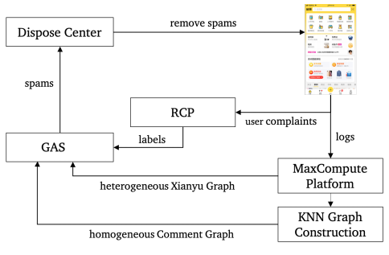

* 文档说明：GNN的网络安全应用
* 作者：网安-531020
### 1. GNN（图神经网络）简介  
&#160; &#160; &#160; &#160;GNN是用于学习包含大量连接的图的联结主义模型。当信息在图的节点之间传播时GNN会捕捉到图的独立性。与标准神经网络不同的是，GNN会保持一种状态，这个状态可以代表来源于人为指定的深度上的信息。  
&#160; &#160; &#160; &#160;图神经网络处理的数据就是图，而图是一种非欧几里得数据。GNN的目标是学习到每个节点的邻居的状态嵌入，这个状态嵌入是向量且可以用来产生输出，例如节点的标记。  
&#160; &#160; &#160; &#160;相比CNN、RNN等成熟技术而言，GNN还处于探索阶段，Graph之于GNN，不如图像之于CNN、自然语言之于RNN来的理所当然。目前国内对GNN研究较深的是阿里团队的graph-learn（原AliGraph），其技术栈如下图：  
  
### 2.GNN在网络安全中的应用  
#### 1. 垃圾评论识别  
&#160; &#160; &#160; &#160;目前阿里团队以Gragh-learn为模型，提出了一种应对“闲鱼”App的基于图卷积网络（GCN）的大规模反垃圾评论检测方法。“闲鱼”是目前国内最大的二手商品交易平台，买卖家可以在商品下面评论进行沟通和询问，但其中也有黑灰产会在商品下面留下一些涉嫌广告、欺诈、假货甚至违禁的评论，影响了用户的使用体验，也给用户带来了风险。为了识别闲鱼上的垃圾评论，阿里结合业务特点，自主设计了基于异构图卷积网络的反垃圾系统-GAS，相对于单节点的深度模型，能够在同样准确率情况下获得16%的覆盖率提升。根据《Spam Review Detection with Graph Convolutional Networks》一文可初步了解其机制。  
  
&#160; &#160; &#160; &#160;当用户在“闲鱼”上发表评论时，日志将存储在MaxCompute平台上，该平台是用于大规模数据仓库的数据处理平台。阿里团队将会选择最近一个月的日志来构建每天的异构图。其步骤如下  
&#160; &#160; &#160; &#160;①根据日志，每天在MaxCompute平台上构建KNN图。    
&#160; &#160; &#160; &#160;②采用GAS的分布式Tensorflow实现来检测垃圾邮件。    
&#160; &#160; &#160; &#160;③从应用程序中删除检测到的垃圾邮件，并且可能禁用了恶意帐户。  
&#160; &#160; &#160; &#160;④RCP（风险检查平台）用于检查受到惩罚的用户的投诉。人类专家审查和支持的投诉将导致惩罚的撤销，并被视为该模型的错误。 RCP的结果将用作标记的样本，以进一步优化该模型。  
#### 2. 恶意账户检测  
&#160; &#160; &#160; &#160;根据Ziqi Liu等人的《Heterogeneous Graph Neural Networks for Malicious Account Detection》一文，其团队提出**GEM**模型，是一个异质图神经网络方法，用于在支付宝中检测恶意账户。该方法受连通子图方法的启发，基于攻击者的两个基本弱点，从异质的账户-设备(account-device)图中自适应地学习到embedding。同时，使用了自注意力机制，为不同类型的节点分配不同的注意力。聚合每种节点的信息时，使用的是求和(sum)的方式。  
&#160; &#160; &#160; &#160;团队总结了来自攻击者的两个主要特征：  
&#160; &#160; &#160; &#160;（1）设备聚集(Device aggregation)  
&#160; &#160; &#160; &#160;攻击者要承受计算资源带来的成本，所以大多数攻击者只在少数计算资源上注册或频繁地登录。  
&#160; &#160; &#160; &#160;（2）行为聚集(Activity aggregation)  
&#160; &#160; &#160; &#160;攻击者受攻击时间的限制，通常要在很短的时间内完成既定目标，所以恶意账户的行为可能在有限的时间内爆发。  
&#160; &#160; &#160; &#160;如今，他们提出基于图表示方法的神经网络，同时关注攻击者“设备聚集”和“行为聚集”两个特点，以实现对恶意账户的检测。是第一个使用GNN方法进行欺诈检测的工作。同时，该反欺诈模型已在支付宝中应用，每天可以有效检测出上万的恶意账户。  
