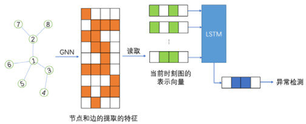

## 图神经网络与异常检测

### 图神经网络特点

  图神经网络（GNN）自从提出以来主要被应用于节点分类等半监督学习任务，其不仅能考虑节点本身的属性，还能同时考虑到网络结构特征，进而刻画黑灰产的关系、团伙以及产业链信息，在风控场景中取得了广泛的应用和效果增益。

### 图神经网络与时序异常检测

​        时间序列模型旨在发现和捕捉数据发生动态演化的内在因素。现有工作大多假设这些内在因素互相独立，而忽略了它们互相之间的关联关系，而使用动态图结构可以表示时间序列内在因子之间的演化关系。

​        使用图神经网络可以对动态图结构的局部状态之间的互相影响和长期记忆对状态的影响建模，来学习各个因子在时序演化上的表示。一个演化网络是一个图，其拓扑结构随时间的变化而变化，不仅节点和边可以随时间演化，而且节点和边的属性也可以随时间演化，可以使用一个图形神经网络和一个递归结构来捕获动态图形的时间演化模式。GNN可以使用一些消息传递过程来更新节点表示，每个节点通过聚合其邻居的表示来更新它的表示，在这个阶段，网络为图的每个节点计算一条消息。为了计算一个节点的消息，网络聚合其邻居的表示。经过k次消息传递过程后，每个节点获得一个特征向量，该特征向量捕获节点k跳邻域内的结构信息。然后，使用GNN计算整个图的特征向量，例如对图的所有节点的表示进行求和。

​        在实际应用中，构造一个编码器-解码器框架。该模型由三部分组成:(1)将图形转换为向量的图形神经网络，(2)读取图形嵌入的输入序列并在下一时间步预测图形嵌入的递归结构，(3)以嵌入作为输入并预测图形拓扑的图形生成模型。可以对时间序列模型中存在的异常进行检测。

### 图神经网络与动态网络异常检测

​        动态网络中的异常检测问题具有非常重要的研究意义，比如发掘正常网络流量中的网络攻击、网络变化中的异常现象等。现存的动态网络异常检测算法主要关注于动态网络的结构特征, 这些做法通过比较不同时刻网络结构之间的不同来给出图的异常分数.为了同时兼顾结构信息和网络节点、边的属性信息。

​        动态变化的图数据在现实应用中广泛存在，有效地对动态网络异常数据进行挖掘，具有重要的科学价值和实践意义。大多数传统的动态网络异常检测算法主要关注于网络结构的异常，而忽视了节点和边的属性以及网络变化的作用。而基于图神经网络的异常检测算法可以将图结构、属性以及动态变化的信息引入模型中，使用图神经网络来对图数据进行建模, 从而能够使算法同时提取网络的结构特征和属性特征, 能够挖掘出更多的异常情况，来学习进行异常检测的表示向量。

​        使用图神经网络将*t*时刻的网络元素信息(节点、边)提取到特征空间, 之后使用无监督学习算法将当前时刻的整个网络表示成一维的向量。在图的表示向量的基础上, 使用成熟的流上的异常检测算法为每一时刻的图进行打分, 可以设定一个阈值并认为分数超过阈值的图存在异常获取其异常分数来实现对动态网络的异常检测。

#### 参考文献

​     [1]Wu C, Nikolentzos G, Vazirgiannis M. EvoNet: A Neural Network for Predicting the Evolution of Dynamic Graphs[J]. arXiv preprint arXiv:2003.00842, 2020.

​     [2]Guo JY, Li RH, Zhang Y, Wang GR. Graph Neural Network Based Anomaly Detection in Dynamic Networks. Journal of Software, 2020, 31(3): 748-762(in Chinese).