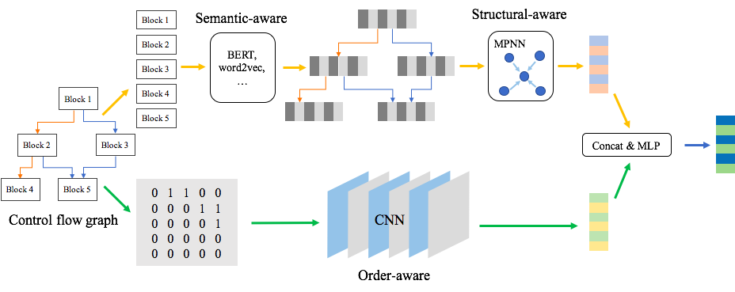

# 图神经网络在网络安全领域的应用

## 简述

传统的深度学习方法被应用在提取欧氏空间数据的特征方面取得了巨大的成功，但许多实际应用场景中的数据是从非欧式空间生成的，传统的深度学习方法在处理非欧式空间数据上的表现却仍难以使人满意，图的复杂性使得现有的深度学习算法在处理时面临着巨大的挑战。由于图是不规则的，每个图都有一个大小可变的无序节点，图中的每个节点都有不同数量的相邻节点，导致一些重要的操作（例如卷积）在图像（Image）上很容易计算，但不再适合直接用于图。此外，现有深度学习算法的一个核心假设是数据样本之间彼此独立。然而，对于图来说，情况并非如此，图中的每个数据样本（节点）都会有边与图中其他实数据样本（节点）相关，这些信息可用于捕获实例之间的相互依赖关系。

近年来，人们对深度学习方法在图上的扩展越来越感兴趣。在多方因素的成功推动下，研究人员借鉴了卷积网络、循环网络和深度自动编码器的思想，定义和设计了用于处理图数据的神经网络结构，由此一个新的研究热点——图神经网络（Graph Neural Networks，GNN）应运而生，GNN在网络安全领域的也发挥了巨大的作用。

## 相关应用

### 二进制相似度检测——Semantic-Aware Neural Networks for Binary Code Similarity Detection

#### 关于

作者：腾讯科恩实验室

来源：AAAI-20

链接：https://keenlab.tencent.com/en/whitepapers/Ordermatters.pdf

#### 背景

二进制安全分析是信息安全中重要研究领域之一，其中一类场景是在不访问源代码的情况下检测相似的二进制函数，也就是找到由同一份源代码所编译出的不同的二进制代码，从而可用于漏洞发现，恶意代码检测，代码克隆检测等多个安全领域中。

#### 工作

1. 提出了一个学习CFG图嵌入的通用框架，该框架可以学习语义信息，结构信息和顺序信息。
2. 在语义学习模型中，采用了带MLM和ANP的BERT来与训练词嵌入和块嵌入
3. 在顺序感知模型中，在邻接矩阵上使用CNN来提取控制流程图的节点顺序信息。
4. 使用了四个数据集，结果表明优于最新的模型。

#### 模型

模型的输入为二进制代码的控制流图，模型的整体结构如图所示，包含semantic-aware 模块、structural-aware模块、order-aware模块。在semantic-aware模块，模型将控制流图作为输入，使用BERT对token embedding作预训练，得到block embedding。在structural-aware模块，使用MPNN算法得到graph semantic & structural embedding。在order-aware模块，模型将控制流图的邻接矩阵作为输入，并使用CNN计算graph order embedding。最后对两个向量使用concat和MLP得到最终的graph embedding

### 基于图神经网络的动态网络异常检测算法

#### 关于

作者：郭嘉琰,李荣华,张岩,王国仁.

来源：软件学报:1-16[2020-05-09].

链接：https://doi.org/10.13328/j.cnki.jos.005903.

#### 背景

大多数传统的动态网络异常检测算法主要关注于网络结构的异常，而忽视了节点和边的属性以及网络变化的作用，有效地对动态网络异常数据进行挖掘具有重要的科学价值和实践意义。

#### 工作

该文章提出了一种基于图神经网络的异常检测算法，将图结构、属性，以及动态变化的信息引入模型中来学习进行异常检测的表示向量。

1. 将图神经网络应用于动态网络异常检测从而使网络异常检测可以同时抓住结构上的异常和属性上的异常
2. 提出Dynamic-DGI的时序网络表示学习框架从而能够使模型脱离标记数据来学习网络变化的一般特征。

#### 不足

该研究基于现有数据集进行模型训练和测试，没有在实际场景下进行应用，可能存在无法在真实场景下获取到所需完整的网络数据、模型效率无法适应网络中实时性的要求等问题。

