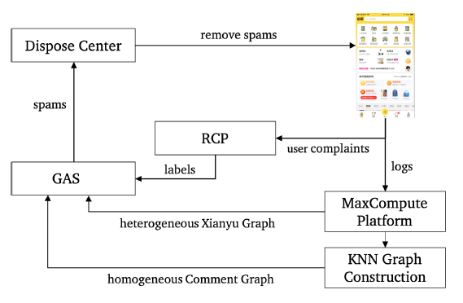

# GNN在垃圾评论治理中的应用

## 1.GNN介绍

图神经网络（GNN）是一种基于在图域上操作的深度学习算法。图作为一种重要的数据结构，通常是由节点和边构成的，节点包含了实体信息，而边包含了实体与实体之间的关系信息。图神经网络主要来源于卷积神经网络（CNN）和图嵌入模型。图神经网络将卷积神经网络中欧几里得数据拓展到了以图为结构的局部连接结构，并且可以共享权重得以减少计算量。

图神经网络模型大致可以分为以下几类，一是根据传播步骤定义的图卷积网络和图注意力网络，二是在动态图上运行的空域网络，三是采用无监督学习的自编码，四是图生成网络。

## 2.GNN应用

采用一种基于图卷积网络的大规模反垃圾评论的方法，可以在中国二手app闲鱼中检测垃圾广告。该模型继承了异构图和同构图以捕获当前文本和全文本上下文之间的关系。根据实验表明，该方法优于利用评论信息、用户特征和被评论事物作为特征的基础模型。

通过研究垃圾评论的特征，不难发现垃圾评论互相之间的关系也是非常重要的，例如垃圾评论广告经常由一些垃圾评论发送方以分组的形式发送。基于这种观察，Wang等人[1]第一个提出了基于图形的垃圾邮件检测方法，他们利用三种类型的节点构建了“审查图”，分别是审查者、存储和审查。当然，效果最好的方法还是基于GCN的方法，Kipf[2]等人将节点的特性从本地邻居聚合起来，将“图卷积”算子定义为一跳邻居的特征集合。通过迭代卷积，信息在途中传播多个跃点，对比之前的DeepWalk挖掘方法效果显著。后来Hamilton[3]等人提出了GraphSAGE的一个归纳框架，可以利用节点采样和特征聚合技术，有效地为不可见数据生成节点嵌入，打破了转换设置中应用GCN的限制。Graph Attention Network（GAT）将注意机制引入到了GCN中，通过计算节点之间的注意系数，GAT可以将每个节点集中于相关的邻居进行决策。类似地，Liu等人通过GEM研究了恶意账号检测的工作，GEM关注的是存在多种类型节点的情况。他们将图按照节点类型划分为不同的子图，并计算每个子图对整个系统的贡献作为注意系数。

GCN曾被用于检测“闲鱼”app上存在的垃圾评论，研究者通过搜集了一段时间内9,158,512位用户在25,107,228件商品下的37,323,039条评论，并标注出了74,213条垃圾评论作为数据集的构建，利用GCN方法训练模型，其系统概述图如下：

工作流程如下：当用户在闲鱼App上发表评论时，日志将会被存储到MaxCompute平台上，基于日志，每天在MaxCompute平台上构建KNN图，再利用GAS（GCN-based Anti Spam）算法的分布式Tensorflow来实现垃圾评论的检测。检测到垃圾评论后会将其从应用中删除，恶意账号也会被禁用。RCP是一个用户被处罚用户的投诉，其数据可以作为模型的进一步优化。通过对比GAS算法、GAS-local-1和TextCNN+MLP三种方法对垃圾评论的检测，可以明显看得出GAS算法的效果是最好的，检测分布图如下图所示：

## 参考文献

[1] Guan Wang, Sihong Xie, Bing Liu, and Philip S Yu. 2012. Identify online store
reviewspammers via social reviewgraph. ACM Transactions on Intelligent Systems
and Technology TIST (2012).

[2]Thomas N Kipf and MaxWelling. 2017. Semi-supervised classification with graph convolutional networks. In 5th International Conference on Learning Representations,ICLR.

[3]Will Hamilton, Zhitao Ying, and Jure Leskovec. 2017. Inductive representation
learning on large graphs. In Advances in Neural Information Processing Systems,
NIPS. 1024–1034.

[4]Petar Veličković, Guillem Cucurull, Arantxa Casanova, Adriana Romero, Pietro
Liò, and Yoshua Bengio. 2018. Graph Attention Networks. International Conference on Learning Representations, ICLR (2018).

[5]Ziqi Liu, Chaochao Chen, Xinxing Yang, Jun Zhou, Xiaolong Li, and Le Song. Heterogeneous Graph Neural Networks for Malicious Account Detection.
In Proceedings of the 27th ACM International Conference on Information and
Knowledge Management, CIKM. ACM, 2077–2085.