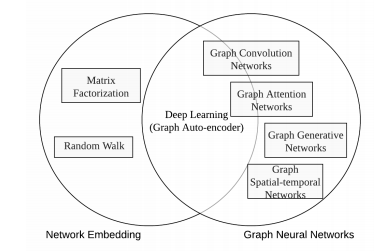
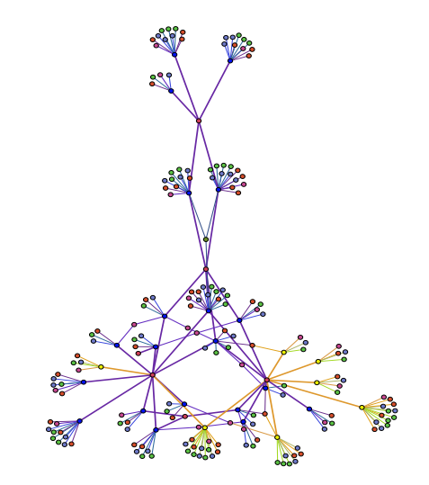
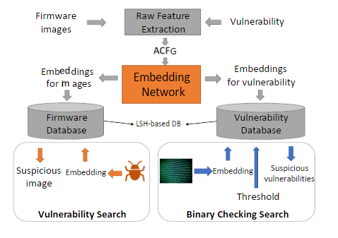

图神经网络在安全领域的应用猜想
===
###### 网络空间安全学院&nbsp;&nbsp;&nbsp;&nbsp;2018级&nbsp;&nbsp;&nbsp;&nbsp;&nbsp;&nbsp;张贺
### 简单理解
##### 图神经网络是神经网络和图数据结构的产物。图是用于存储多个节点以及各节点之间组成的多种复杂关系的数据结构。基于图数据的处理系统能够很好地表征不规则的、相互依赖的、无序的、具有复杂关系的数据模型。利用图神经网络，能够利用神经网络这种自适应的、非线性的数据处理、统计及建模工具来分析基于图结构的数据集合。

### 用于恶意帐户检测
##### 攻击者通过创建恶意账户，可以传播垃圾邮件、散布虚假信息、窃取账户来达到赚取钱财的目的。利用图神经网络可以通过捕获攻击者的两个特征，或称弱点— —“设备聚合”和“活动聚合”，来鉴别恶意账户。这里解释一下这两个概念：
##### 设备聚合：由于攻击成本的限制，攻击者很可能只能控制很有限的计算机资源，那么单个攻击者或者一组攻击者拥有的这些账户将在少数资源上频繁注册、登录。 活动聚合：一般来说，攻击者都期望在尽量短的时间内完成攻击目的。这说明攻击者会使用能力范围下的资源使得恶意账户在有限地时间内爆发。
##### 因此，使用图神经网络构建基于真实数据特征的异构图，可以对恶意账户进行建模。

### 社交软件虚假新闻检测
##### 当今社交媒体平台选择越来越多，用户基数越来越大。因此，软件中的新闻报道的真实与否，将对人们的生活造成一定影响。但是新闻数量十分庞大，传统方式很难实现有效的过滤。
##### 利用图神经网络可以实现虚假信息的（半监督）鉴别机制。神经网络具有自适应（学习）特性，图数据结构具有不规则等特性，可以表征上下文关系等复杂关系。这样的结构体系在鉴别虚假消息方面具有很大的优势。

### （二进制）代码相似检测
##### 随着计算机技术的不断发展，各式各样的应用软件、硬件环境不断涌现。世界上绝大多数，或者说所有的编程代码都不是完美无缺、绝对安全的。大量漏洞、后门仍然存留，而一般的应用软件的用户基数都比较庞大，某个错误代码部分可能存在在世界范围的每一个角落。甚至还有一些故意开发的恶意应用。这些错误代码可能分布在不同应用、不同主机、不同硬件体系上。因此，设计一种（二进制）代码的相似检测算法，能直接在多个平台上纠错，节省人力财力。
##### 传统的检测机制是运用图匹配算法，但是这种方法拓展性不高，对不同的应用检测精度不够，而且效率也有较大限制。使用图神经网络可以很好地解决这个问题。基于函数的流程图，使用图嵌入网络，甚至可以实现端到端的代码相似性检测。

###### 参考文献：
###### [1]Ziqi Liu , Chaochao Chen , Xinxing Yang ,etc.Heterogeneous Graph Neural Networks for Malicious Account Detection[C].Proceedings of the 27th ACM International Conference on Information and Knowledge Management.:ACM,2018.2077-2085.
###### [2]Xiaojun Xu , Chang Liu profile imageChang Liu , Qian Feng profile imageQian Feng ,etc.Neural Network-based Graph Embedding for Cross-Platform Binary Code Similarity Detection[C].Proceedings of the 2017 ACM SIGSAC Conference on Computer and Communications Security.:ACM,2017.363-376.
###### [3]Adrien Benamira , Benjamin Devillers profile imageBenjamin Devillers , Etienne Lesot profile imageEtienne Lesot ,etc.Semi-supervised learning and graph neural networks for fake news detection[C].Proceedings of the 2019 IEEE/ACM International Conference on Advances in Social Networks Analysis and Mining.:IEEE/ACM,2019.568-569.