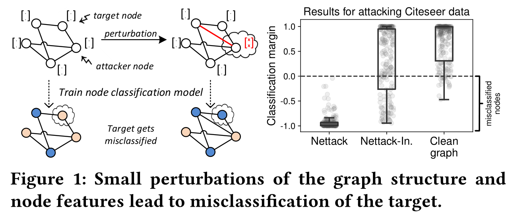

## 图神经网络中结构与特征对神经网络的攻击

图神经网络被誉为面向未来的网络结构，在了解图神经网络之后确实是感受到了它的思想，就是将网络结构从规范的数据扩展到了不规则的数据。

在安全方面，GCN如果被用于特征识别，那么**对抗攻击**就是一个很重要的点。

因为一旦GCN被攻击，那么基于GCN的classification等都会受到波及。某些说法是这样讲的，图神经网络是新时代的人工智能网络。

在了解GCN攻击之后，我发现对抗攻击的思想就是求约束下的极值，在原图上通过对原图进行结构或者特征的扰动得到攻击图片，设置LOSS函数评估攻击图片与原图的差异，求在小于loss下，对网络分类攻击的最大值下的图片。

那么现在问题就成了如何对构或者特征进行扰动，设置怎样评估原图与攻击图片的差异，怎样求约束下使得分类精确率最低的攻击图片等。

很自然而然的，最朴素的扰动就是随机更改，差异评价可以使用很多已有的函数，约束下的极值可以用贪心算法。

在以下论文中，作者对这些问题进行了解答，并且效果肯定会比随机扰动好。

我对GCN不是很了解，查了些资料，决定以一篇论文笔记的形式展示GCN的用处`Adversarial Attacks on Neural Networks for Graph Data`(KDD 2018最佳论文:首个面向网络图类的对抗攻击研究)。

作者提出了直接攻击和影响攻击。为了确保即使在离散的关系域中也不会出现明显的变化，保留图形的度分布和特征同现。在离散数据中进行有效扰动。即使只有部分图形或攻击仅限于少数影响，分类性能也会不断降低。甚至，攻击还可以推广到其他节点分类模型。

[TOC]

### 1 GCN的引入

#### 1.1 传统CNN

在现实生活中，存在着大量以位置、距离作为重要性分布衡量标准的数据，由于局部性原理，离得越近影响越大，应该是一个不证自明的公理：比如和自己居住更近的人更有可能对自己影响更大(位置相关)。股票的走势预测应该更加关注近段时间的数据趋势，图片每个像素点和周边像素点的关联度更大。

以 图片为例，如果简单地认为与当前像素欧式距离小于和等于的像素点重要性较高，欧式距离大于到像素点重要性较低，那么我们就很轻松的简化了每个像素点的重要性分布问题（即让远处的影响衰减），得到以下表达式：
$$
\Large o_j=\sigma(\sum_{dist(i,j)\le\frac{k}{\sqrt{2}}}w_{ij}x_i+b_j)
$$
其中$dist(i,j)$表示节点$i, j$之间的欧式距离。

#### 1.2 非欧几何

由于CNN网络输入需要固定的张量大小，所以这对原始数值的处理提出了很高的要求，而且还有很多数据是不能用欧式几何表示的，比如图数据。这个时候需要引入新的网络：

在GCN中第$l+1$层$ H^{(l+1)}$被表示为：
$$
\large H^{(l+1)}=\sigma(\tilde{D}^{-\frac12}\tilde{A}\tilde{D}^{-\frac12}H^{(l)}W^{(l)})
$$

### 2 对抗攻击

#### 2.1 目标

在$G$上施加扰动使得GCN在分类$G'$时精确度降低。

#### 2.2 模型

**符号：**$A$是$G$的邻接矩阵，$\tilde{A}=A+I_N$，$D_{ii}=\sum_j\tilde{A}_{ij}$，

然后考虑模型
$$
Z = f_θ (A,X) = \mathbb{softmax}(\hat{A}σ(\hat{A}XW^{(1)})W^{(2)})
$$
$\hat{A}=\tilde{D}^{-\frac12}\tilde{A}\tilde{D}^{-\frac12}$，$\theta$是靠
$$
\Large \arg\min_{\theta}L(\theta;A,X)=-\sum_{v\in \mathcal{V}_L}\ln{Z_{v,c_v}}
$$
得到的，$Z_{v,c_v}$指将node $v$判定为$c$类的概率。

#### 2.3 攻击

##### 2.3.1 攻击概述

攻击分为结构攻击与特征攻击。

##### 2.3.2 对扰动进行评估

###### **方法一**

使用图的度分布差别来衡量结构的差异，这里必须要使得扰动后的$G'$与$G$必须差距很小，作者的方法设置的阈值是$0.004$。

###### **方法二**

保持节点特征统计特性的扰动。为了反映不同特征的相关性，利用特征中构建特征共现图，作者基于特征同时出现的频率来看两个图上的节点特征是否不容易区分。

论文的具体做法是从$G^{(0)}$的特征中构建特征共现图$C=(F,E)$，其中 *F* 是特征集合，而$E$表示特征的共现关系。在共现图中，一个添加给节点 *u* 的特征 *i* 是不容易识别的，如果特征 *i* 能够以较大的概率从 *u* 的已有特征中一跳内可达。

即
$$
\forall u\in \mathcal{V}:\forall i\in \mathcal{F}:X_{ui}'=1\Rightarrow i \in S_u \or P(i\mid S_u)>\sigma
$$

##### 2.3.3 问题转化

###### 描述

在2.3.2的约束下，问题转化为求：
$$
\Large \arg\max_{(A',X')}\ \max\ln(Z^*_{v_0,c})-\ln(Z^*_{v_0,c_{old}})
$$
$subject\ to\  Z^* = f_{θ^*} (A',X')\ with \ {θ^*}=\arg\min_{\theta}L(\theta_{θ^*};A',X')$.

###### 算法

贪心思想：

算法输入的是原图、被攻击的节点、攻击节点集合、攻击预算。当没有超过攻击预算时，算法会选出当前局部最优的最大的边和特征，并从两者中选出最大的一个作为本次循环选取的对图进行修改的值。

#### 2.4 评估

可以看到的是这个攻击比随机的扰动效果好很多。

